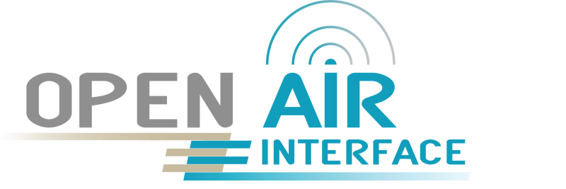
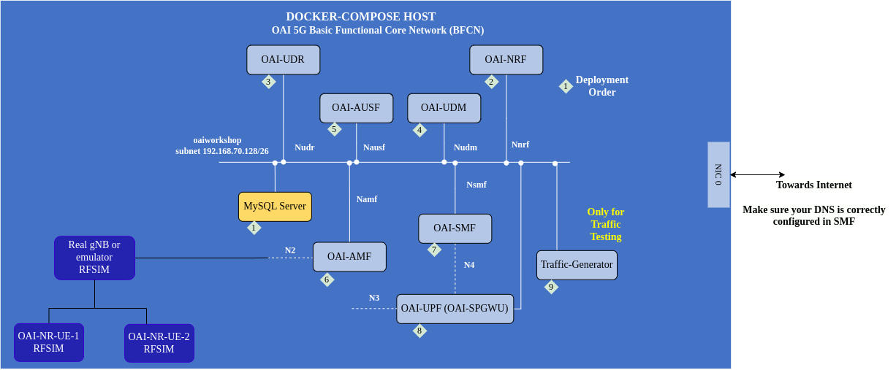
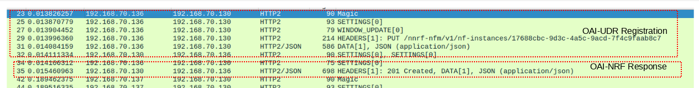
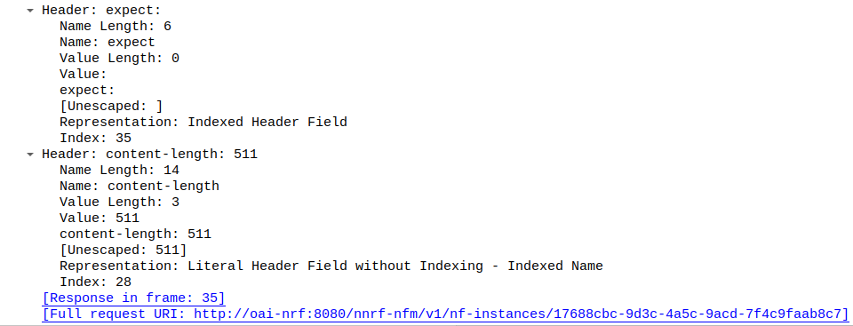
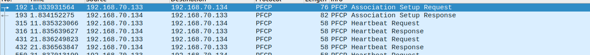
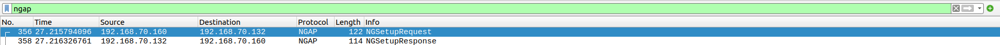

<table style="border-collapse: collapse; border: none;">
  <tr style="border-collapse: collapse; border: none;">
    <td style="border-collapse: collapse; border: none;">
      <a href="http://www.openairinterface.org/">
         
         </img>
      </a>
    </td>
    <td style="border-collapse: collapse; border: none; vertical-align: center;">
      <b><font size = "5">OpenAirInterface 5G Core Network Workshop</font></b>
    </td>
  </tr>
</table>




The aim of this tutorial is to explain: 

1. How to use OAI5G Core Network Functions
2. How OAI5G Core Network works end to end with a RF Simulated `oai-gnb` and `oai-nr-ue`
3. How to perform traffic tests

**Hardware Requirements**

1. A laptop or remote server with minimum 4vCPU and 8GB of RAM and 4GB of storage. 
2. Make sure your laptop/remote server CPU supports `avx2` as it is needed by gNB/NR-UE containers. You can check via `lscpu | grep avx2`
3. Operating System: Ubuntu 22.04/24.04, RHEL 9/10, Fedora 40+, other linux based OS may work as well.
4. **Note**: Apple M1/M2/M3 laptops and Windows Linux Subsystem (WSL) are not yet tested.

**Software Prerequisites**

|Software      |Version       |
|:-------------|:-------------|
|Docker engine |Minimum 25.04 |
|tshark        |Minimum 4.6.0 |
|wireshark     |Minimum 4.6.0 |

**Please make sure to [follow the steps in the training material](../README.md)**

**NOTE**: 

1. If you are using docker engine version > 21 then `compose` command is included in `docker`. If you do not have docker installed [follow the training material](../README.md).
2. We are using `docker compose` without `-` in this tutorial, so if you have installed `docker-compose` please adjust the commands accordingly.
3. **DISCLAIMER**: OAI official container repository is `docker.io/oaisoftwarealliance`. Due to [docker hub pull limitation](https://docs.docker.com/docker-hub/usage/) for unauthenticated users. It is recommended to use either your personal docker account to pull images or use our Github registry `ghcr.io/openairinterface` only setup for workshops. 
4. If you want to see the resource consumption of `docker containers` you can use `docker stats` command
5. If you want to see the processes running inside a container you can do `docker top`

**Reading time**: ~ 20mins

**Tutorial replication time**: ~ 60mins

**TABLE OF CONTENTS**

[[_TOC_]]

## 1. Create the Environment

1. Create a results for to store all the result files of the tutorial:

``` shell
#optional if you have already cloned it is fine
git clone https://gitlab.eurecom.fr/oai/trainings/oai-workshops.git
cd oai-workshops/cn
mkdir results
## Open access so tshark can store the results
chmod 777 results 
```

2. Pull all the container images which are required in this tutorial. In case you do not want to pull the images now `docker compose` will pull the images for you.

```bash
##Recommended to login to your docker hub account
docker compose pull
  Pulling mysql              ... done
  Pulling oai-nrf            ... done
  Pulling oai-udr            ... done
  Pulling oai-udm            ... done
  Pulling oai-ausf           ... done
  Pulling ims                ... done
  Pulling oai-amf            ... done
  Pulling oai-smf            ... done
  Pulling oai-upf            ... done
  Pulling oai-traffic-server ... done
```

Pull ran images: 

```bash
docker pull ghcr.io/openairinterface/oai-nr-ue:2025.w45
docker pull ghcr.io/openairinterface/oai-gnb:2025.w45
## in case of issues with github you can fall back to docker hub
docker pull oaisoftwarealliance/oai-nr-ue:2025.w45
docker pull oaisoftwarealliance/oai-gnb:2025.w45
```

3. (Optional) If you want to run the gNB and core in different systems then you need some forwarding rules: 

```bash
sudo sysctl net.ipv4.conf.all.forwarding=1
sudo iptables -P FORWARD ACCEPT
# You also need to add a route in the gNB to access the core network
sudo ip route add route CORE_NETWORK_DOCKER_SUBNET via IP_ADDRESS_OF_CORE_NETWORK_HOST_MACHINE dev gNB_NIC_TOWARDS_CORE_NETWORK
```

## 2. Configure the OAI5G Core Network Functions

1. The [docker compose](./docker-compose.yml) file has containers/images related parameters:
    - Which version of the images to use
    - Name and IP addresses of the containers
2. The [config.yaml](./conf/config.yaml) file has the real network configuration parameters such as:
    - PLMN / Slices
    - DNN
    - ...

Please spend 5-10 mins to understand the [docker compose](./docker-compose.yml) and [config.yaml](./conf/config.yaml) to configure OAI core network.

## 3. Create the network interface

1. Create docker network interface so that we can capture initial packets to understand what happens when core network starts, for this we will create mysql container to initialize the network.

```bash
cd oai-workshops/cn
docker compose -f docker-compose.yml up -d mysql
```

2. Run wireshark with or without `root` privileges (based on how you have configured) select `oaiworkshop` interface.

Use the following capture filter:

```
sctp || icmp || tcp.port == 8080 || udp.port == 8080 || tcp.port == 8805 || udp.port == 8805 || tcp.port == 3306
```

(Optional) You can also capture packets using `tshark` command. 

```bash
sudo tshark -i oaiworkshop -f "sctp or port 80 or port 8080 or port 8805 or icmp or port 3306" -w results/oaiworkshop.pcap
```

**NOTE**: You can also capture exercise by exercise so you have small pcaps. In this case the command will be slightly different:

```bash
sudo tshark -i oaiworkshop -f "sctp or port 80 or port 8080 or port 8805 or icmp or port 3306" -w results/exercise_deploy_core.pcap
```

After each exercise use CTRL+C to stop the packet capture. 

## 4. Deploy OAI5G Core Network

1. Deploy the core network (make sure you are in `oai-workshops/cn` folder)

```bash
docker compose -f docker-compose.yml up -d
```

2. Wait for the core network to be healthy. You can check the core network state using:

```bash
watch docker compose -f docker-compose.yml ps -a

Every 2,0s: docker compose -f docker-compose.yml ps -a

NAME         IMAGE                                          COMMAND                  SERVICE              CREATED          STATUS                    PORTS
ims          ghcr.io/openairinterface/ims:latest            "asterisk -fp"           ims                  25 seconds ago   Up 24 seconds (healthy)   
mysql        ghcr.io/openairinterface/mysql:8.0             "docker-entrypoint.s…"   mysql                6 minutes ago    Up 6 minutes (healthy)    3306/tcp, 33060/tcp
oai-amf      ghcr.io/openairinterface/oai-amf:develop       "/openair-amf/bin/oa…"   oai-amf              25 seconds ago   Up 23 seconds (healthy)   80/tcp, 5342-5344/tcp, 8080/tcp, 9090/tcp, 38412/sctp
oai-ausf     ghcr.io/openairinterface/oai-ausf:develop      "/openair-ausf/bin/o…"   oai-ausf             25 seconds ago   Up 23 seconds (healthy)   80/tcp, 5342-5344/tcp, 8080/tcp
oai-ext-dn   ghcr.io/openairinterface/trf-gen-cn5g:latest   "/bin/bash /tmp/trfg…"   oai-traffic-server   25 seconds ago   Up 24 seconds (healthy)   
oai-nrf      ghcr.io/openairinterface/oai-nrf:develop       "/openair-nrf/bin/oa…"   oai-nrf              25 seconds ago   Up 24 seconds (healthy)   80/tcp, 5342-5344/tcp, 8080/tcp
oai-smf      ghcr.io/openairinterface/oai-smf:develop       "/openair-smf/bin/oa…"   oai-smf              25 seconds ago   Up 23 seconds (healthy)   80/tcp, 5342-5344/tcp, 8080/tcp, 9090/tcp, 8805/udp
oai-udm      ghcr.io/openairinterface/oai-udm:develop       "/openair-udm/bin/oa…"   oai-udm              25 seconds ago   Up 24 seconds (healthy)   80/tcp, 5342-5344/tcp, 8080/tcp
oai-udr      ghcr.io/openairinterface/oai-udr:develop       "/openair-udr/bin/oa…"   oai-udr              25 seconds ago   Up 24 seconds (healthy)   80/tcp, 8080/tcp
oai-upf      ghcr.io/openairinterface/oai-upf:develop       "sh /openair-upf/bin…"   oai-upf              25 seconds ago   Up 23 seconds (healthy)   80/tcp, 2152/udp, 5342-5344/tcp, 8805/udp
```

3. Check the ip-addresses of the network functions to understand wireshark traces. Below command will output a table

```bash
docker compose ps -q | xargs -I {} docker inspect   --format '{{.Name}} - {{range .NetworkSettings.Networks}}{{.IPAddress}}{{end}}' {}   | sed 's#^/##'
``` 

The ip-addresses are static so we can follow the traces

```
ims - 192.168.70.139
mysql - 192.168.70.131
oai-amf - 192.168.70.132
oai-ausf - 192.168.70.138
oai-ext-dn - 192.168.70.135
oai-nrf - 192.168.70.130
oai-smf - 192.168.70.133
oai-udm - 192.168.70.137
oai-udr - 192.168.70.136
oai-upf - 192.168.70.134
```

4. In this core network scenario:
  
  - All Network Function(s) (NF) registers to NRF
  - AMF subscribes to SMF registration event via NRF for SMF selection
  - SMF subscribes to UPF registration event via NRF for UPF discovery
  - SMF sends UPF PFCP Association Setup Request

We can check all these requests from the PCAPs or logs. You can see this in the below screenshot




Check the logs of `oai-nrf` and you will see the `oai-udr` registration 

```bash
docker logs oai-nrf
```

<details>
<summary>Snippet from the logs: </summary>

```console
[2025-11-14 15:04:07.511] [nrf_sbi] [info] Got a request to register an NF instance/Update an NF instance, Instance ID: 17688cbc-9d3c-4a5c-9acd-7f4c9faab8c7
[2025-11-14 15:04:07.511] [nrf_app] [debug] Handle Register NF Instance/Update NF Instance (HTTP version 2)
[2025-11-14 15:04:07.511] [nrf_app] [debug] NF Profile with ID 17688cbc-9d3c-4a5c-9acd-7f4c9faab8c7, NF type UDR
[2025-11-14 15:04:07.511] [nrf_app] [debug] Convert a json-type profile to a NF profile (profile ID: 17688cbc-9d3c-4a5c-9acd-7f4c9faab8c7)
[2025-11-14 15:04:07.511] [nrf_app] [debug]   Instance name: OAI-UDR
[2025-11-14 15:04:07.511] [nrf_app] [debug] Set NF status to REGISTERED
[2025-11-14 15:04:07.511] [nrf_app] [debug] getCustomInfo -> null
[2025-11-14 15:04:07.511] [nrf_app] [debug]   Status: REGISTERED
[2025-11-14 15:04:07.511] [nrf_app] [debug]   Heartbeat timer: 50
[2025-11-14 15:04:07.511] [nrf_app] [debug]   Priority: 1
[2025-11-14 15:04:07.511] [nrf_app] [debug]   Capacity: 100
[2025-11-14 15:04:07.511] [nrf_app] [debug]   FQDN: 
[2025-11-14 15:04:07.511] [nrf_app] [debug]   IPv4 Addr: 192.168.70.136
[2025-11-14 15:04:07.511] [nrf_app] [debug]   UDR profile, UDR Info
[2025-11-14 15:04:07.511] [nrf_app] [debug]      GroupId - oai-udr-testgroupid
[2025-11-14 15:04:07.511] [nrf_app] [debug]      SupiRanges: Start - 208950000000131, End - , Pattern - ^imsi-20895[31-131]{6}$
[2025-11-14 15:04:07.511] [nrf_app] [debug]      GpsiRanges: Start - 752740000, End - 752749999, Pattern - ^gpsi-75274[0-9]{4}$
[2025-11-14 15:04:07.512] [nrf_app] [debug] Check if a profile with this ID 17688cbc-9d3c-4a5c-9acd-7f4c9faab8c7 exist
[2025-11-14 15:04:07.512] [nrf_app] [debug] NF profile (ID 17688cbc-9d3c-4a5c-9acd-7f4c9faab8c7) not found
[2025-11-14 15:04:07.512] [nrf_app] [info] Added/Updated NF Profile (ID 17688cbc-9d3c-4a5c-9acd-7f4c9faab8c7) to the DB
[2025-11-14 15:04:07.512] [nrf_app] [debug] Subscribe to the HeartbeatTimer expire event (after NF registration): interval 20, current time 1763129047512
[2025-11-14 15:04:07.512] [nrf_app] [info] Handle NF status registered event, profile id 17688cbc-9d3c-4a5c-9acd-7f4c9faab8c7
[2025-11-14 15:04:07.512] [nrf_app] [info]  Find a NF profile with ID 17688cbc-9d3c-4a5c-9acd-7f4c9faab8c7
[2025-11-14 15:04:07.512] [nrf_app] [info]  Get the list of subscriptions related to this profile, profile id 17688cbc-9d3c-4a5c-9acd-7f4c9faab8c7
[2025-11-14 15:04:07.512] [nrf_app] [debug]   No subscription found
[2025-11-14 15:04:07.512] [nrf_app] [debug] Added/Updated NF Profile with the NF instance info
[2025-11-14 15:04:07.512] [nrf_app] [debug] NF instance info
[2025-11-14 15:04:07.512] [nrf_app] [debug]   Instance ID: 17688cbc-9d3c-4a5c-9acd-7f4c9faab8c7
[2025-11-14 15:04:07.512] [nrf_app] [debug]   Instance name: OAI-UDR
[2025-11-14 15:04:07.512] [nrf_app] [debug]   Instance type: UDR
[2025-11-14 15:04:07.512] [nrf_app] [debug]   Status: REGISTERED
[2025-11-14 15:04:07.512] [nrf_app] [debug]   HeartBeat timer: 10
[2025-11-14 15:04:07.512] [nrf_app] [debug]   Priority: 1
[2025-11-14 15:04:07.512] [nrf_app] [debug]   Capacity: 100
[2025-11-14 15:04:07.512] [nrf_app] [debug]   IPv4 Addr: 192.168.70.136
[2025-11-14 15:04:07.512] [nrf_app] [debug]   UDR Info
[2025-11-14 15:04:07.512] [nrf_app] [debug]     GroupId: oai-udr-testgroupid
[2025-11-14 15:04:07.512] [nrf_app] [debug]      SupiRanges: Start - 208950000000131, End - , Pattern - ^imsi-20895[31-131]{6}$
[2025-11-14 15:04:07.512] [nrf_app] [debug]      GpsiRanges: Start - 752740000, End - 752749999, Pattern - ^gpsi-75274[0-9]{4}$
[2025-11-14 15:04:07.512] [nrf_app] [info] Added/Updated NF Instance, NF info: {"capacity":100,"heartBeatTimer":10,"ipv4Addresses":["192.168.70.136"],"json_data":null,"nfInstanceId":"17688cbc-9d3c-4a5c-9acd-7f4c9faab8c7","nfInstanceName":"OAI-UDR","nfServices":[],"nfStatus":"REGISTERED","nfType":"UDR","priority":1,"udrInfo":{"externalGroupIdentifiersRanges":[],"gpsiRanges":[{"end":"752749999","pattern":"^gpsi-75274[0-9]{4}$","start":"752740000"}],"groupId":"oai-udr-testgroupid","routingIndicators":[],"supiRanges":[{"end":"","pattern":"^imsi-20895[31-131]{6}$","start":"208950000000131"}]}}
```
</details>

5. PFCP heartbeat exchange between SMF and UPF

   - SMF and UPF exchange PFCP heartbeat messages



<details>
<summary>Check the logs of oai-smf: </summary>

```console
[2025-11-15 06:52:24.607] [smf_sbi] [debug] Discover UPF with NRF, response from NRF
[2025-11-15 06:52:24.607] [smf_sbi] [debug] Response data {"nfInstances":[{"capacity":100,"heartBeatTimer":10,"ipv4Addresses":["192.168.70.134"],"json_data":null,"nfInstanceId":"4cba686f-ac5c-426a-83b1-f0d4129de60a","nfInstanceName":"OAI-UPF","nfServices":[],"nfStatus":"REGISTERED","nfType":"UPF","priority":1,"sNssais":[{"sd":"FFFFFF","sst":1}],"upfInfo":{"sNssaiUpfInfoList":[{"dnnUpfInfoList":[{"dnn":"oai"},{"dnn":"openairinterface"},{"dnn":"ims"},{"dnn":"default"}],"sNssai":{"sd":"FFFFFF","sst":1}}]}}],"searchId":"1","validityPeriod":100000}
[2025-11-15 06:52:24.607] [smf_sbi] [debug] HTTP Response Code: 200
[2025-11-15 06:52:24.607] [smf_app] [debug] Process UPF Discovery response
[2025-11-15 06:52:24.607] [smf_sbi] [debug] Send NFSubscribeNotify to NRF to be notified when a new UPF becomes available (HTTP version 2)
[2025-11-15 06:52:24.607] [smf_sbi] [debug] NRF's URL: http://oai-nrf:8080/nnrf-nfm/v1/subscriptions
[2025-11-15 06:52:24.607] [smf_sbi] [debug] Message body: {"nfStatusNotificationUri":"http://192.168.70.133:8080/nsmf-nfstatus-notify/v1/subscriptions","reqNotifEvents":["NF_REGISTERED","NF_DEREGISTERED"],"subscrCond":{"nfType":"UPF"},"validityTime":"20390531T235959"}
[2025-11-15 06:52:24.607] [smf_sbi] [debug] Send a simple HTTP request
[2025-11-15 06:52:24.607] [smf_app] [warning] Could not parse SearchResult from JSON
[2025-11-15 06:52:24.610] [smf_api] [info] NFStatusNotifyApiImpl, received a NF status notification...
[2025-11-15 06:52:24.610] [smf_app] [info] Handle a NF status notification from NRF (HTTP version 2)
[2025-11-15 06:52:24.610] [smf_app] [debug] Process UPF Profile
[2025-11-15 06:52:24.610] [smf_app] [debug] UPF with host name 192.168.70.134 was not found in configuration, take default configuration
[2025-11-15 06:52:24.610] [smf_app] [debug] Start a PFCP Association procedure with an UPF
[2025-11-15 06:52:24.610] [common] [debug] Resolving an FQDN/IP Addr for an UPF node
[2025-11-15 06:52:24.610] [common] [debug] Resolving an IP address (name 192.168.70.134)
[2025-11-15 06:52:24.610] [common] [debug] Reverse Resolving Try #0
[2025-11-15 06:52:24.611] [smf_sbi] [debug] Response data {"nfStatusNotificationUri":"http://192.168.70.133:8080/nsmf-nfstatus-notify/v1/subscriptions","reqNotifEvents":["NF_REGISTERED","NF_DEREGISTERED"],"subscrCond":{"nfType":"UPF"},"subscriptionId":"1","validityTime":"20390531T235959"}
[2025-11-15 06:52:24.611] [smf_sbi] [debug] NFSubscribeNotify, response from NRF, HTTP Code: 201
[2025-11-15 06:52:24.611] [smf_sbi] [debug] NFSubscribeNotify, got successful response from NRF
[2025-11-15 06:52:24.611] [common] [debug] Resolve IP Addr 192.168.70.134, FQDN oai-upf.oaiworkshop
[2025-11-15 06:52:24.616] [smf_n4 ] [info] handle_receive(40 bytes)
[2025-11-15 06:52:24.616] [smf_n4 ] [debug] handle_receive_pfcp_msg msg type 6 length 36
[2025-11-15 06:52:24.616] [smf_n4 ] [info] Received N4 ASSOCIATION SETUP RESPONSE from an UPF
[2025-11-15 06:52:24.616] [smf_n4 ] [info] Received N4 ASSOCIATION SETUP RESPONSE
[2025-11-15 06:52:24.616] [common] [debug] Resolving an FQDN/IP Addr for an UPF node
[2025-11-15 06:52:24.616] [common] [debug] Resolving an IP address (name 192.168.70.134)
[2025-11-15 06:52:24.616] [common] [debug] Reverse Resolving Try #0
[2025-11-15 06:52:24.616] [common] [debug] Resolve IP Addr 192.168.70.134, FQDN oai-upf.oaiworkshop
[2025-11-15 06:52:24.616] [smf_app] [debug] Found UPF config for pending PFCP association 192.168.70.134
[2025-11-15 06:52:24.616] [smf_app] [debug] UPF Interface list is empty: Assume that the UPF has an N3 interface.
[2025-11-15 06:52:24.616] [smf_app] [debug] UPF Interface list is empty: Assume that the UPF has an N6 interface.
[2025-11-15 06:52:24.616] [smf_app] [info] Successfully added UPF node: 192.168.70.134
[2025-11-15 06:52:24.616] [smf_app] [debug] Successfully added UPF graph edge for 192.168.70.134: - UPF Graph Edge
  + Interface Type.............................: N3
  + NWI........................................: 
  + Uplink.....................................: No

[2025-11-15 06:52:24.616] [smf_app] [debug] Successfully added UPF graph edge for 192.168.70.134: - UPF Graph Edge
  + Interface Type.............................: N6
  + NWI........................................: 
  + Uplink.....................................: No

[2025-11-15 06:52:24.616] [smf_app] [debug] UPF graph
[2025-11-15 06:52:24.616] [smf_app] [debug] 
 - Node.........................................: 192.168.70.134
  + Edges
    - UPF Graph Edge
      + Interface Type.........................: N3
      + NWI....................................: 
      + Uplink.................................: No
    - UPF Graph Edge
      + Interface Type.........................: N6
      + NWI....................................: 
      + Uplink.................................: No

[2025-11-15 06:52:24.616] [smf_app] [debug] Added PFCP association with UPF config: 
 + 192.168.70.134
      + host...................................: 192.168.70.134
      + port...................................: 8805
      + enable_usage_reporting.................: No
      + enable_qers............................: No
      + enable_upf_wo_nf_discovery.............: No
      + enable_dl_pdr_in_session_establishment.: No
      + upf_info:
        - snssai_upf_info_item:
          + snssai:
            - sst..............................: 1
            - sd...............................: ffffff
          + dnns:
            - dnn..............................: oai
            - dnn..............................: openairinterface
            - dnn..............................: ims
            - dnn..............................: default

[2025-11-15 06:52:26.612] [common] [debug] Resolving an FQDN/IP Addr for an UPF node
[2025-11-15 06:52:26.612] [smf_app] [debug] NFSubscribeNotify response
[2025-11-15 06:52:29.612] [smf_n4 ] [info] TIME-OUT event timer id 3
[2025-11-15 06:52:33.610] [smf_app] [info] TIME-OUT event timer id 1
[2025-11-15 06:52:33.610] [smf_app] [debug] Send ITTI msg to N11 task to trigger NRF Heartbeat
[2025-11-15 06:52:33.610] [smf_sbi] [debug] Send NF Update to NRF (HTTP version 2)
[2025-11-15 06:52:33.610] [smf_sbi] [debug] Send NF Update to NRF, Msg body [{"op":"replace","path":"/nfStatus","value":"REGISTERED"}]
[2025-11-15 06:52:33.610] [smf_sbi] [debug] Send NF Update to NRF, NRF URL http://oai-nrf:8080/nnrf-nfm/v1/nf-instances/f36ad555-54be-4bab-b41e-885849bb937b
[2025-11-15 06:52:33.610] [smf_sbi] [debug] Send a simple HTTP request
[2025-11-15 06:52:33.663] [smf_sbi] [debug] Response data 
[2025-11-15 06:52:33.663] [smf_sbi] [debug] NF Instance Update, response from NRF, HTTP Code: 204
[2025-11-15 06:52:33.663] [smf_sbi] [debug] NF Update, response from NRF: 
 
[2025-11-15 06:52:33.664] [smf_app] [debug] NF Update NF response
[2025-11-15 06:52:33.664] [smf_app] [debug] SMF has successfully registered to NRF.
[2025-11-15 06:52:33.664] [smf_app] [debug] Set NRF Heartbeat timer (10)
[2025-11-15 06:52:34.617] [smf_n4 ] [info] TIME-OUT event timer id 4
[2025-11-15 06:52:34.617] [smf_n4 ] [info] PFCP HEARTBEAT PROCEDURE hash 2252777664 starting
[2025-11-15 06:52:34.617] [smf_n4 ] [info] handle_receive(16 bytes)
[2025-11-15 06:52:34.617] [smf_n4 ] [debug] handle_receive_pfcp_msg msg type 2 length 12
[2025-11-15 06:52:39.617] [smf_n4 ] [info] TIME-OUT event timer id 8
[2025-11-15 06:52:43.664] [smf_app] [info] TIME-OUT event timer id 5
```
</details>

## 5. Deploy OAI-GNB and UEs

Here we are using oai-gnb in rfsimulator mode in a docker container, you will learn more about oai-gnb in the next hands-on session. 

In case you want to use the non-containerize environment then please refer to the [RAN workshop](../ran/README.md). 

*Make sure you are still capturing the logs or start capturing again for this exercise*.

### 5.1 Deploy OAI-GNB


Open three terminals and in one of the terminal follow the below instructions:

```bash
cd oai-workshops/cn
docker logs oai-amf -f
```

Second terminal

```bash
cd oai-workshops/cn
docker logs oai-smf -f
```

Third terminal

```bash
docker compose -f docker-compose-ran.yml up -d oai-gnb
```

Wait for the gNB to be healthy and meanwhile you can check the logs of `oai-amf`.

Check the wireshark with filter `NGAP` or search in your traces *NGSetupRequest* and *NGSetupResponse* 



<details>
<summary>Check the logs of oai-amf to see what happened there: </summary>

```console
[2025-11-15 07:45:14.598] [sctp] [debug] SCTP Association Change event received
[2025-11-15 07:45:14.598] [sctp] [debug] Add new association with Id (131)
[2025-11-15 07:45:14.598] [sctp] [info] ----------------------
[2025-11-15 07:45:14.598] [sctp] [info] Local addresses: 
[2025-11-15 07:45:14.598] [sctp] [info]     - IPv4 Addr: 192.168.70.132
[2025-11-15 07:45:14.598] [sctp] [info] ----------------------
[2025-11-15 07:45:14.598] [sctp] [info] Peer addresses: 
[2025-11-15 07:45:14.598] [sctp] [info]     - IPv4 Addr: 192.168.70.160
[2025-11-15 07:45:14.598] [sctp] [info] ----------------------
[2025-11-15 07:45:14.598] [ngap] [debug] Ready to handle new NGAP SCTP association request (id 131)
[2025-11-15 07:45:14.598] [ngap] [debug] Create a new gNB context with assoc_id (131)
[2025-11-15 07:45:14.598] [sctp] [info] [Assoc_id 131, Socket 8] Received a message (length 57) from port 44886, on stream 0, PPID 60
[2025-11-15 07:45:14.598] [ngap] [debug] Handling SCTP payload from SCTP Server on assoc_id (131), stream_id (0), instreams (2), outstreams (2)
[2025-11-15 07:45:14.598] [ngap] [debug] Decoded NGAP message, procedure code 21, present 1
InitiatingMessage ::= {
    procedureCode: 21
    criticality: 0 (reject)
    value: NGSetupRequest ::= {
        protocolIEs: ProtocolIE-Container ::= {
            NGSetupRequestIEs ::= {
                id: 27
                criticality: 0 (reject)
                value: GlobalGNB-ID ::= {
                    pLMNIdentity: 00 F1 10
                    gNB-ID: 00 00 E0 00 (4 bits unused)
                }
            }
            NGSetupRequestIEs ::= {
                id: 82
                criticality: 1 (ignore)
                value: gnb-rfsim
            }
            NGSetupRequestIEs ::= {
                id: 102
                criticality: 0 (reject)
                value: SupportedTAList ::= {
                    SupportedTAItem ::= {
                        tAC: 00 00 01
                        broadcastPLMNList: BroadcastPLMNList ::= {
                            BroadcastPLMNItem ::= {
                                pLMNIdentity: 00 F1 10
                                tAISliceSupportList: SliceSupportList ::= {
                                    SliceSupportItem ::= {
                                        s-NSSAI: S-NSSAI ::= {
                                            sST: 01
                                        }
                                    }
                                }
                            }
                        }
                    }
                }
            }
            NGSetupRequestIEs ::= {
                id: 21
                criticality: 1 (ignore)
                value: 0 (v32)
            }
        }
    }
}
[2025-11-15 07:45:14.598] [ngap] [debug] [gNB Assoc Id 131] Sending ITTI NG Setup Request message to TASK_AMF_N2
InitiatingMessage ::= {
    procedureCode: 21
    criticality: 0 (reject)
    value: NGSetupRequest ::= {
        protocolIEs: ProtocolIE-Container ::= {
            NGSetupRequestIEs ::= {
                id: 27
                criticality: 0 (reject)
                value: GlobalGNB-ID ::= {
                    pLMNIdentity: 00 F1 10
                    gNB-ID: 00 00 E0 00 (4 bits unused)
                }
            }
            NGSetupRequestIEs ::= {
                id: 82
                criticality: 1 (ignore)
                value: gnb-rfsim
            }
            NGSetupRequestIEs ::= {
                id: 102
                criticality: 0 (reject)
                value: SupportedTAList ::= {
                    SupportedTAItem ::= {
                        tAC: 00 00 01
                        broadcastPLMNList: BroadcastPLMNList ::= {
                            BroadcastPLMNItem ::= {
                                pLMNIdentity: 00 F1 10
                                tAISliceSupportList: SliceSupportList ::= {
                                    SliceSupportItem ::= {
                                        s-NSSAI: S-NSSAI ::= {
                                            sST: 01
                                        }
                                    }
                                }
                            }
                        }
                    }
                }
            }
            NGSetupRequestIEs ::= {
                id: 21
                criticality: 1 (ignore)
                value: 0 (v32)
            }
        }
    }
}
[2025-11-15 07:45:14.598] [ngap] [debug] Received TAC 0x1
[2025-11-15 07:45:14.598] [amf_n2] [info] Received NGSetupRequest message, handling
[2025-11-15 07:45:14.598] [amf_n2] [debug] [gNB Assoc ID 131] Handle NG Setup Request...
[2025-11-15 07:45:14.598] [amf_n2] [debug] Parameters: assoc_id 131, stream 0
[2025-11-15 07:45:14.598] [amf_n2] [debug] Update gNB context with assoc id (131)
[2025-11-15 07:45:14.598] [amf_n2] [debug] RAN Node Info, Global RAN Node ID: 0xe00, MCC 001, MNC 01
[2025-11-15 07:45:14.598] [amf_n2] [debug] IE RanNodeName: gnb-rfsim
[2025-11-15 07:45:14.598] [amf_n2] [debug] IE DefaultPagingDRX: 0
[2025-11-15 07:45:14.598] [amf_n2] [debug] TAC configured 1, TAC received 1
[2025-11-15 07:45:14.598] [amf_n2] [debug] Common PLMN MCC 001, MNC 01
[2025-11-15 07:45:14.598] [amf_n2] [debug] S-NSSAI from gNB (SST 1, SD FFFFFF)
[2025-11-15 07:45:14.598] [amf_n2] [debug] S-NSSAI from AMF (SST 1, SD FFFFFF)
[2025-11-15 07:45:14.598] [amf_n2] [debug] Common S-NSSAI (SST 1, SD FFFFFF)
[2025-11-15 07:45:14.598] [amf_n2] [debug] GNB PLMN (001, 01) is included in the common PLMNs
[2025-11-15 07:45:14.598] [amf_n2] [debug] Encoding NG_SETUP_RESPONSE ...
SuccessfulOutcome ::= {
    procedureCode: 21
    criticality: 0 (reject)
    value: NGSetupResponse ::= {
        protocolIEs: ProtocolIE-Container ::= {
            NGSetupResponseIEs ::= {
                id: 1
                criticality: 0 (reject)
                value: OAI-AMF
            }
            NGSetupResponseIEs ::= {
                id: 96
                criticality: 0 (reject)
                value: ServedGUAMIList ::= {
                    ServedGUAMIItem ::= {
                        gUAMI: GUAMI ::= {
                            pLMNIdentity: 00 F1 10
                            aMFRegionID: 01
                            aMFSetID: 00 40 (6 bits unused)
                            aMFPointer: 04 (2 bits unused)
                        }
                    }
                }
            }
            NGSetupResponseIEs ::= {
                id: 86
                criticality: 1 (ignore)
                value: 30
            }
            NGSetupResponseIEs ::= {
                id: 80
                criticality: 0 (reject)
                value: PLMNSupportList ::= {
                    PLMNSupportItem ::= {
                        pLMNIdentity: 00 F1 10
                        sliceSupportList: SliceSupportList ::= {
                            SliceSupportItem ::= {
                                s-NSSAI: S-NSSAI ::= {
                                    sST: 01
                                }
                            }
                        }
                    }
                }
            }
        }
    }
}
[2025-11-15 07:45:14.598] [ngap] [debug] Encoded size (49)
[2025-11-15 07:45:14.598] [sctp] [debug] [Socket 8, Assoc ID 131] Sending buffer 0x75a100000e00 of 49 bytes on stream 0 with PPID 60
[2025-11-15 07:45:14.598] [sctp] [debug] Successfully sent 49 bytes on stream 0
[2025-11-15 07:45:14.598] [amf_n2] [debug] Sending NG_SETUP_RESPONSE Ok
[2025-11-15 07:45:14.598] [amf_n2] [debug] gNB with gNB_id 0xe00, assoc_id 131 has been attached to AMF
[2025-11-15 07:45:14.598] [amf_app] [debug] A new gNB has been successfully added!
[2025-11-15 07:45:14.599] [ngap] [debug] Free NGAP Message PDU
[2025-11-15 07:45:14.599] [ngap] [debug] Free NGAP Message PDU
[2025-11-15 07:45:17.964] [amf_app] [info] 
   |------------------------------------------------------------------------------------------------------------------------------------------------------------|
   |----------------------------------------------------------------------gNBs' Information---------------------------------------------------------------------|
   |  Index |               Status               |              Global Id             |              gNB Name              |                PLMN                |
   |    1   |              Connected             |               0x0E00               |              gnb-rfsim             |               001,01               |
   |------------------------------------------------------------------------------------------------------------------------------------------------------------|
```

</details>


### 5.2 Deploy OAI-NR-UE

Open a fourth terminal and start the UE.

```bash
docker compose -f docker-compose-ran.yml up -d oai-nr-ue1
```

Now lets try to analyze the logs of each NF, we will do it together. You can stop the wireshark traces or tshark (open the file). Use the filters as suggested below. 

We will try to answer below questions:

#### What just happened? 

*Hint*: 
- Use the filter `ngap` and then you can use `ngap || tcp.port == 8080`

1. What is the first message from the UE that arrives at AMF?
2. What is the initial procedure UE has to follow?
3. How many NF(s) in the current deployed scenario are involved in this procedure? Please only mention the NFs of the current scenario. You might have to check the logs of each NF. 
4. What do you think will happen if the `key` or `opc` is not correct? Which message in `wireshark` will help us understand this? 
5. What is this message `UERadioCapabilityInfoIndication`? How it is useful? 
6. Where do you see the slicing information for the first time?

#### But the real deal is ip-address!

*Hint*:
- Use the filter `ngap` 
- and then you can use `ngap || tcp.port == 8080`
- and then you can use `udp.port == 8805`
- Use `docker exec oai-nr-ue ip a`

1. What is a Protocol Data Unit (PDU) session in 5G? When a User Equipment (UE) requests for one? In which wireshark message you can see UE is asking for a PDU session? 
2. How many NF(s) in the current deployed scenario are involved in providing UE an IP-address? Please only mention the NFs of the current scenario. You might have to check the logs of each NF. (Note: PCF is not their in this scenario, SMF is doing its job)
3. What is the UE ip-address?
4. How do you make sure that the UE can resolve a FQDN, to make sure that the DNS has to be properly configured in SMF?

## 6. Traffic test

Now that we have an IP address and a successful PDU session, we can perform traffic tests using ping utility.

*Make sure you are still capturing the logs or start capturing again for this exercise*.

Get inside the UE and try to ping `8.8.8.8` or `10.0.0.1` or `192.168.70.135`

```bash
docker exec -it oai-nr-ue bash
## check the interfaces, if you don't see oaitun_ue1 interface then you should inform the team
ip a
## ping towards internet
ping -I oaitun_ue1 8.8.8.8 -c4
## ping towards upf
ping -I oaitun_ue1 10.0.0.1 -c4
## ping towards oai-traffic-generator
ping -I oaitun_ue1 192.168.70.135 -c4
exit
```

(optional) Connect the second UE and check `oai-amf` and `oai-smf` logs

```bash
docker compose -f docker-compose-ran.yml up -d oai-nr-ue2
```

```bash
## check the interfaces, if you don't see oaitun_ue1 interface then you should inform the team
docker exec oai-nr-ue2 ip a

1: lo: <LOOPBACK,UP,LOWER_UP> mtu 65536 qdisc noqueue state UNKNOWN group default qlen 1000
    link/loopback 00:00:00:00:00:00 brd 00:00:00:00:00:00
    inet 127.0.0.1/8 scope host lo
       valid_lft forever preferred_lft forever
    inet6 ::1/128 scope host 
       valid_lft forever preferred_lft forever
2: eth0@if27: <BROADCAST,MULTICAST,UP,LOWER_UP> mtu 1500 qdisc noqueue state UP group default 
    link/ether 9e:9f:d1:cd:65:d7 brd ff:ff:ff:ff:ff:ff link-netnsid 0
    inet 192.168.70.151/26 brd 192.168.70.191 scope global eth0
       valid_lft forever preferred_lft forever
3: oaitun_ue1: <POINTOPOINT,NOARP,UP,LOWER_UP> mtu 1500 qdisc fq_codel state UNKNOWN group default qlen 500
    link/none 
    inet 10.0.0.4/24 scope global oaitun_ue1
       valid_lft forever preferred_lft forever
    inet6 fe80::37a:e316:18c:6467/64 scope link stable-privacy 
       valid_lft forever preferred_lft forever
```

```bash
docker exec -it oai-nr-ue2 bash
## ping towards internet
ping -I oaitun_ue1 8.8.8.8 -c4
## ping towards upf
ping -I oaitun_ue1 10.0.0.1 -c4
## ping towards oai-traffic-generator
ping -I oaitun_ue1 192.168.70.135 -c4
exit
```

## 7. Disconnect the UEs

We should know what happens when a UE disconnects, for this we need to gracefully stop container of one of the UEs. We can stop both of them one by one to understand the logs. 

*Make sure you are still capturing the logs or start capturing again for this exercise.*

Stop UE1:

```bash
docker compose -f docker-compose-ran.yml down -t2 oai-nr-ue1
```

**NOTE**: Don't disconnect the gNB, we still need it. 

Where should we start? Are you still checking AMF and SMF logs in your terminal? There must be some activity. Lets try to follow that. 

<details>
<summary> AMF logs: </summary>

```console
[2025-11-15 15:44:15.794] [ngap] [debug] Handling SCTP payload from SCTP Server on assoc_id (4), stream_id (1), instreams (2), outstreams (2)
[2025-11-15 15:44:15.794] [ngap] [debug] Decoded NGAP message, procedure code 46, present 1
InitiatingMessage ::= {
    procedureCode: 46
    criticality: 1 (ignore)
    value: UplinkNASTransport ::= {
        protocolIEs: ProtocolIE-Container ::= {
            UplinkNASTransport-IEs ::= {
                id: 10
                criticality: 0 (reject)
                value: 3
            }
            UplinkNASTransport-IEs ::= {
                id: 85
                criticality: 0 (reject)
                value: 2
            }
            UplinkNASTransport-IEs ::= {
                id: 38
                criticality: 0 (reject)
                value: 
                    7E 02 6F 60 86 B2 03 7E 04 45 10 00 0B F2 00 F1 
                    10 01 00 41 65 A1 73 E2
            }
            UplinkNASTransport-IEs ::= {
                id: 121
                criticality: 1 (ignore)
                value: UserLocationInformationNR ::= {
                    nR-CGI: NR-CGI ::= {
                        pLMNIdentity: 00 F1 10
                        nRCellIdentity: 00 00 E0 14 E0 (4 bits unused)
                    }
                    tAI: TAI ::= {
                        pLMNIdentity: 00 F1 10
                        tAC: 00 00 01
                    }
                }
            }
        }
    }
}
[2025-11-15 15:44:15.794] [ngap] [debug] Sending ITTI Uplink NAS Transport message to TASK_AMF_N2
InitiatingMessage ::= {
    procedureCode: 46
    criticality: 1 (ignore)
    value: UplinkNASTransport ::= {
        protocolIEs: ProtocolIE-Container ::= {
            UplinkNASTransport-IEs ::= {
                id: 10
                criticality: 0 (reject)
                value: 3
            }
            UplinkNASTransport-IEs ::= {
                id: 85
                criticality: 0 (reject)
                value: 2
            }
            UplinkNASTransport-IEs ::= {
                id: 38
                criticality: 0 (reject)
                value: 
                    7E 02 6F 60 86 B2 03 7E 04 45 10 00 0B F2 00 F1 
                    10 01 00 41 65 A1 73 E2
            }
            UplinkNASTransport-IEs ::= {
                id: 121
                criticality: 1 (ignore)
                value: UserLocationInformationNR ::= {
                    nR-CGI: NR-CGI ::= {
                        pLMNIdentity: 00 F1 10
                        nRCellIdentity: 00 00 E0 14 E0 (4 bits unused)
                    }
                    tAI: TAI ::= {
                        pLMNIdentity: 00 F1 10
                        tAC: 00 00 01
                    }
                }
            }
        }
    }
}
[2025-11-15 15:44:15.794] [ngap] [debug] Received TAC 0x1
[2025-11-15 15:44:15.794] [amf_n2] [info] Received Uplink NAS Transport message, handling
[2025-11-15 15:44:15.794] [amf_n2] [debug] Handle Uplink NAS Transport...
[2025-11-15 15:44:15.794] [ngap] [debug] Free NGAP Message PDU
[2025-11-15 15:44:15.794] [amf_n1] [info] Received UL_NAS_DATA_IND
[2025-11-15 15:44:15.794] [amf_n1] [debug] Serving network name 5G:mnc001.mcc001.3gppnetwork.org
[2025-11-15 15:44:15.794] [amf_n1] [debug] Existing nas_context with amf_ue_ngap_id 3
[2025-11-15 15:44:15.794] [common] [debug] [amf_n1]Received Uplink NAS Message
7e 02 6f 60 86 b2 03 7e 04 45 10 00 0b f2 00 f1 10 01 00 41 65 a1 73 e2 
[2025-11-15 15:44:15.794] [amf_n1] [debug] Received integrity protected and ciphered NAS message
[2025-11-15 15:44:15.794] [amf_n1] [debug] Received integrity protected with new security context NAS message
[2025-11-15 15:44:15.794] [amf_n1] [debug] Received integrity protected and ciphered with new security context NAS message
[2025-11-15 15:44:15.794] [common] [debug] [amf_n1]Parameters for NIA: Knas_int
5f b2 e8 da 90 a5 3e 41 44 37 25 76 19 8b 58 39 
[2025-11-15 15:44:15.794] [amf_n1] [debug] Uplink count in uplink: 3
[2025-11-15 15:44:15.794] [amf_n1] [debug] Parameters for NIA, count: 0x2
[2025-11-15 15:44:15.794] [amf_n1] [debug] Parameters for NIA, bearer: 0x1
[2025-11-15 15:44:15.794] [amf_n1] [debug] Parameters for NIA, direction: 0x0
[2025-11-15 15:44:15.794] [common] [debug] [amf_n1]Parameters for NIA, message: 
03 7e 04 45 10 00 0b f2 00 f1 10 01 00 41 65 a1 73 e2 
[2025-11-15 15:44:15.794] [amf_n1] [debug] Integrity with algorithms: 128-5G-IA1
[2025-11-15 15:44:15.795] [common] [debug] [amf_n1]Result for NIA1, mac: 
6f 60 86 b2 
[2025-11-15 15:44:15.795] [amf_n1] [debug] Result for NIA1, mac32: 0x6f6086b2
[2025-11-15 15:44:15.795] [amf_n1] [debug] Received mac32 (0x6f6086b2) from the message
[2025-11-15 15:44:15.795] [amf_n1] [debug] Integrity matched
[2025-11-15 15:44:15.795] [amf_n1] [debug] nsc.ul_count.overflow 0
[2025-11-15 15:44:15.795] [amf_n1] [debug] Cipher protected with EA0_5G
[2025-11-15 15:44:15.795] [common] [debug] [amf_n1]Decoded Plain Message
7e 04 45 10 00 0b f2 00 f1 10 01 00 41 65 a1 73 e2 
[2025-11-15 15:44:15.795] [amf_n1] [debug] Received Uplink NAS message...
[2025-11-15 15:44:15.795] [amf_n1] [debug] Received De-registration Request message, handling...
[2025-11-15 15:44:15.795] [amf_n1] [debug] Handling UE-initiated De-registration Request
[2025-11-15 15:44:15.795] [nas] [debug] Decoding DeregistrationRequest message
[2025-11-15 15:44:15.795] [nas] [debug] Decoding NasMmPlainHeader
[2025-11-15 15:44:15.795] [nas] [debug] Decoded NasMmPlainHeader len (3 octets)
[2025-11-15 15:44:15.795] [nas] [debug] Decoding 5GSMobilityIdentity
[2025-11-15 15:44:15.795] [nas] [debug] Decoded 5GSMobilityIdentity IE length 11
[2025-11-15 15:44:15.795] [nas] [debug] Decoding 5GSMobilityIdentity 5G-GUTI
[2025-11-15 15:44:15.795] [nas] [debug] MCC 001, MNC 01
[2025-11-15 15:44:15.795] [nas] [debug] MCC 001, MNC 01
[2025-11-15 15:44:15.795] [nas] [debug] TMSI 0x65a173e2
[2025-11-15 15:44:15.795] [nas] [debug] Decoding 5GSMobilityIdentity 5G-GUTI
[2025-11-15 15:44:15.795] [nas] [debug] Decoded 5GS Mobile Identity, len (13)
[2025-11-15 15:44:15.795] [nas] [debug] Decoded DeregistrationRequest message (len 17)
[2025-11-15 15:44:15.795] [amf_n1] [debug] 5G Mobile Identity Type 2
[2025-11-15 15:44:15.795] [nas] [debug] 5G GUTI 001010100411705079778
[2025-11-15 15:44:15.795] [amf_n1] [debug] 5G Mobile Identity, GUTI 001010100411705079778
[2025-11-15 15:44:15.795] [amf_n1] [debug] Key for UE context search: app_ue_ranid_2:amfid_3
[2025-11-15 15:44:15.795] [amf_n1] [debug] Promise ID generated 12
[2025-11-15 15:44:15.795] [amf_sbi] [info] Receive Nsmf_PDUSessionReleaseSMContext, handling ...
[2025-11-15 15:44:15.796] [amf_sbi] [debug] smf_info, context location http://oai-smf:8080/nsmf-pdusession/v1/sm-contexts/4
[2025-11-15 15:44:15.796] [amf_sbi] [debug] SMF's URI: http://oai-smf:8080/nsmf-pdusession/v1/sm-contexts/4/release
[2025-11-15 15:44:15.796] [amf_sbi] [info] Send HTTP message to http://oai-smf:8080/nsmf-pdusession/v1/sm-contexts/4/release
[2025-11-15 15:44:15.796] [amf_sbi] [info] HTTP message Body: {"cause":"REL_DUE_TO_REACTIVATION"}
[2025-11-15 15:44:15.796] [amf_sbi] [debug] Send a simple HTTP request
[2025-11-15 15:44:15.801] [amf_sbi] [info] Get response with HTTP code (204)
[2025-11-15 15:44:15.802] [amf_sbi] [info] Could not get JSON content from the response
[2025-11-15 15:44:15.802] [amf_app] [debug] Trigger process response: Set promise with ID 12 to ready
[2025-11-15 15:44:15.802] [amf_server] [debug] Got result for promise ID 12
[2025-11-15 15:44:15.802] [amf_app] [debug] PDU Session ID 10 removed
[2025-11-15 15:44:15.802] [amf_n1] [debug] De-registration Type 0x0
[2025-11-15 15:44:15.802] [nas_mm] [debug] Size of Deregistration Accept message 3
[2025-11-15 15:44:15.802] [nas] [debug] Encoding De-registration Accept message
[2025-11-15 15:44:15.802] [nas] [debug] Encoding NasMmPlainHeader
[2025-11-15 15:44:15.802] [nas] [debug] Encoded NasMmPlainHeader (len 3 octets)
[2025-11-15 15:44:15.802] [nas] [debug] Encoded De-registration Accept message len (3)
[2025-11-15 15:44:15.803] [common] [debug] [amf_n1]De-registration Accept message buffer
7e 00 46 
[2025-11-15 15:44:15.803] [amf_n2] [info] Received Downlink NAS Transport message, handling
[2025-11-15 15:44:15.803] [amf_n2] [debug] Handle DL NAS Transport ...
InitiatingMessage ::= {
    procedureCode: 4
    criticality: 1 (ignore)
    value: DownlinkNASTransport ::= {
        protocolIEs: ProtocolIE-Container ::= {
            DownlinkNASTransport-IEs ::= {
                id: 10
                criticality: 0 (reject)
                value: 3
            }
            DownlinkNASTransport-IEs ::= {
                id: 85
                criticality: 0 (reject)
                value: 2
            }
            DownlinkNASTransport-IEs ::= {
                id: 38
                criticality: 0 (reject)
                value: 7E 00 46
            }
        }
    }
}
[2025-11-15 15:44:15.803] [ngap] [debug] Encoded size (27)
[2025-11-15 15:44:15.803] [sctp] [debug] [Socket 4, Assoc ID 4] Sending buffer 0x79ab80001a30 of 27 bytes on stream 1 with PPID 60
[2025-11-15 15:44:15.803] [sctp] [debug] Successfully sent 27 bytes on stream 1
[2025-11-15 15:44:15.803] [ngap] [debug] Free NGAP Message PDU
[2025-11-15 15:44:16.003] [amf_app] [debug] The UE's state (IMSI 001010000000102, State 5GMM-DEREGISTERED) has been successfully updated!
[2025-11-15 15:44:16.003] [amf_n1] [debug] Set 5GMM state to 5GMM-DEREGISTERED
[2025-11-15 15:44:16.003] [amf_app] [info] 
   |------------------------------------------------------------------------------------------------------------------------------------------------------------|
   |----------------------------------------------------------------------gNBs' Information---------------------------------------------------------------------|
   |  Index |               Status               |              Global Id             |              gNB Name              |                PLMN                |
   |    1   |              Connected             |               0x0E00               |              gnb-rfsim             |               001,01               |
   |------------------------------------------------------------------------------------------------------------------------------------------------------------|

   |-----------------------------------------------------------------------------------------------------------------------------------------------------------|
   |---------------------------------------------------------------------UEs' Information----------------------------------------------------------------------|
   |  Index |     5GMM State     |        IMSI        |        GUTI        |   RAN UE NGAP ID   |   AMF UE NGAP ID   |        PLMN        |       Cell Id      |
   |    1   |   5GMM-REGISTERED  |   001010000000101  |00101010041214161160|        0x01        |        0x02        |       001,01       |      0000e014e     |
   |    2   |  5GMM-DEREGISTERED |   001010000000102  |00101010041170507977|        0x02        |        0x03        |       001,01       |      0000e014e     |
   |-----------------------------------------------------------------------------------------------------------------------------------------------------------|

[2025-11-15 15:44:16.003] [amf_n1] [debug] Signal the UE Registration State Event notification for SUPI imsi-001010000000102
[2025-11-15 15:44:16.003] [amf_n1] [debug] Send request to SBI to trigger UE Registration State Report (SUPI imsi-001010000000102 )
[2025-11-15 15:44:16.003] [amf_n1] [debug] Signal the UE Loss of Connectivity Event notification for SUPI imsi-001010000000102
[2025-11-15 15:44:16.003] [amf_n1] [debug] Send request to SBI to trigger UE Loss of Connectivity (SUPI imsi-001010000000102 )
[2025-11-15 15:44:16.003] [amf_app] [debug] The UE's state (IMSI 001010000000102, State 5GMM-DEREGISTERED) has been successfully updated!
[2025-11-15 15:44:16.003] [amf_n1] [debug] Deleted nas_context associated with amf_ue_ngap_id 3
[2025-11-15 15:44:16.003] [amf_n1] [debug] Deleted nas_context associated SUPI imsi-001010000000102 
[2025-11-15 15:44:16.003] [nas] [debug] 5G GUTI 001010100411705079778
[2025-11-15 15:44:16.003] [nas] [debug] 5G GUTI 001010100411705079778
[2025-11-15 15:44:16.003] [amf_n1] [debug] Deleted nas_context associated GUTI 001010100411705079778 
[2025-11-15 15:44:16.003] [amf_n1] [debug] Sending ITTI UE Context Release Command to TASK_AMF_N2
[2025-11-15 15:44:16.003] [amf_n1] [debug] Signal the UE Connectivity Status Event notification for SUPI imsi-001010000000102
[2025-11-15 15:44:16.003] [amf_n1] [debug] Send request to SBI to trigger UE Connectivity State Report (SUPI imsi-001010000000102 )
[2025-11-15 15:44:16.003] [amf_n2] [info] Received UE Context Release Command message, handling
[2025-11-15 15:44:16.003] [amf_n2] [debug] Handling UE Context Release Command ...
InitiatingMessage ::= {
    procedureCode: 41
    criticality: 0 (reject)
    value: UEContextReleaseCommand ::= {
        protocolIEs: ProtocolIE-Container ::= {
            UEContextReleaseCommand-IEs ::= {
                id: 114
                criticality: 0 (reject)
                value: UE-NGAP-ID-pair ::= {
                    aMF-UE-NGAP-ID: 3
                    rAN-UE-NGAP-ID: 2
                }
            }
            UEContextReleaseCommand-IEs ::= {
                id: 15
                criticality: 1 (ignore)
                value: 2 (deregister)
            }
        }
    }
}
[2025-11-15 15:44:16.003] [ngap] [debug] Encoded size (20)
[2025-11-15 15:44:16.004] [sctp] [debug] [Socket 4, Assoc ID 4] Sending buffer 0x79ab80001a30 of 20 bytes on stream 1 with PPID 60
[2025-11-15 15:44:16.004] [sctp] [debug] Successfully sent 20 bytes on stream 1
[2025-11-15 15:44:16.004] [amf_n1] [warning] No NAS context with amf_ue_ngap_id 3
[2025-11-15 15:44:16.004] [amf_n2] [warning] Could not notify RAN caused CommunicationFailure.No existing nas_context with amf_ue_ngap_id(3)
[2025-11-15 15:44:16.004] [ngap] [debug] Free NGAP Message PDU
[2025-11-15 15:44:16.201] [sctp] [info] [Assoc_id 4, Socket 4] Received a message (length 26) from port 37073, on stream 1, PPID 60
[2025-11-15 15:44:16.201] [ngap] [debug] Handling SCTP payload from SCTP Server on assoc_id (4), stream_id (1), instreams (2), outstreams (2)
[2025-11-15 15:44:16.201] [ngap] [debug] Decoded NGAP message, procedure code 41, present 2
SuccessfulOutcome ::= {
    procedureCode: 41
    criticality: 0 (reject)
    value: UEContextReleaseComplete ::= {
        protocolIEs: ProtocolIE-Container ::= {
            UEContextReleaseComplete-IEs ::= {
                id: 10
                criticality: 1 (ignore)
                value: 3
            }
            UEContextReleaseComplete-IEs ::= {
                id: 85
                criticality: 1 (ignore)
                value: 2
            }
            UEContextReleaseComplete-IEs ::= {
                id: 60
                criticality: 0 (reject)
                value: PDUSessionResourceListCxtRelCpl ::= {
                    PDUSessionResourceItemCxtRelCpl ::= {
                        pDUSessionID: 10
                    }
                }
            }
        }
    }
}
[2025-11-15 15:44:16.201] [ngap] [debug] Sending ITTI UE Context Release Complete to TASK_AMF_N2
[2025-11-15 15:44:16.201] [amf_n2] [info] Received UE Context Release Complete message, handling
[2025-11-15 15:44:16.201] [amf_n2] [debug] Handle UE Context Release Complete ...
[2025-11-15 15:44:16.201] [amf_n2] [debug] UE Context Release Complete ran_ue_ngap_id (2) amf_ue_ngap_id (3)
[2025-11-15 15:44:16.201] [amf_n2] [debug] Release cause 0 No UE NGAP context with gnb_assoc_id 4, Release gnb_assoc_id 0
[2025-11-15 15:44:16.201] [amf_n2] [debug] Continue with UE Context Release Complete procedure
[2025-11-15 15:44:16.201] [amf_n1] [warning] No NAS context with amf_ue_ngap_id 3
[2025-11-15 15:44:16.201] [amf_n2] [warning] No existed nas_context with amf_ue_ngap_id (3)
```
</details>


<details>
<summary>SMF logs: </summary>

```console
[2025-11-15 15:44:15.800] [smf_api] [info] Received a SM context update request from AMF.
[2025-11-15 15:44:15.800] [smf_api] [debug] Message content 
 {"cause":"REL_DUE_TO_REACTIVATION"}
[2025-11-15 15:44:15.800] [smf_api] [info] smf_ref 4, method release
[2025-11-15 15:44:15.800] [smf_api] [info] Handle Release SM Context Request from AMF
[2025-11-15 15:44:15.800] [common] [debug] Parsing the message with the Simple Parser
[2025-11-15 15:44:15.800] [smf_api] [debug] Number of MIME parts 0
[2025-11-15 15:44:15.800] [smf_api] [info] Handle PDU Session Release SM Context Request.
[2025-11-15 15:44:15.800] [smf_app] [debug] Convert SmContextReleaseMessage (OpenAPI) to PDUSession_ReleaseSMContext
[2025-11-15 15:44:15.800] [smf_api] [debug] Promise ID generated 123
[2025-11-15 15:44:15.800] [smf_api] [info] Received a PDUSession_ReleaseSMContext Request: PDU Session Release request from AMF.
[2025-11-15 15:44:15.800] [smf_app] [info] Handle a PDU Session Release SM Context Request from an AMF
[2025-11-15 15:44:15.800] [smf_app] [debug] Retrieve SMF context with SUPI imsi-001010000000102
[2025-11-15 15:44:15.800] [smf_app] [info] Find PDU Session with ID 10
[2025-11-15 15:44:15.800] [smf_app] [info] Handle a PDU Session Release SM Context Request
[2025-11-15 15:44:15.800] [smf_app] [info] Find PDU Session with ID 10
[2025-11-15 15:44:15.800] [smf_app] [info] Release SM Context Request
[2025-11-15 15:44:15.800] [smf_app] [info] Find PDU Session with ID 10
[2025-11-15 15:44:15.800] [smf_app] [debug] DFS Asynch: Handle UPF 192.168.70.134
[2025-11-15 15:44:15.800] [smf_app] [info] Sending ITTI message 32itti_n4_session_deletion_request to task TASK_SMF_N4
[2025-11-15 15:44:15.800] [smf_app] [debug] Send ITTI msg to SMF APP to trigger the response of HTTP Server
[2025-11-15 15:44:15.800] [smf_app] [debug] Trigger the response from SMF: Set promise with ID 123 to ready
[2025-11-15 15:44:15.800] [smf_api] [debug] Got result for promise ID 123
[2025-11-15 15:44:15.801] [smf_n4 ] [info] handle_receive(21 bytes)
[2025-11-15 15:44:15.801] [smf_n4 ] [debug] handle_receive_pfcp_msg msg type 55 length 17
[2025-11-15 15:44:15.801] [smf_app] [debug] Received N4 Session Deletion Response sender teid 0x4  pfcp_tx_id 7C 
[2025-11-15 15:44:15.801] [smf_app] [info] Handle itti_n4_session_deletion_response (Release SM Context Request): pdu-session-id 10
[2025-11-15 15:44:15.801] [smf_app] [debug] UPF graph in SMF finished
[2025-11-15 15:44:15.801] [smf_app] [info] PDU Session Release SM Context accepted by UPFs
[2025-11-15 15:44:15.801] [smf_app] [info] Resources associated with this PDU Session have been released
[2025-11-15 15:44:15.801] [smf_app] [info] Sending ITTI message N11_SESSION_RELEASE_SM_CONTEXT_RESPONSE to task TASK_SMF_APP
[2025-11-15 15:44:15.801] [smf_app] [info] Handle N4 Session Deletion Response
[2025-11-15 15:44:15.801] [smf_app] [debug] PDU Session Release SM Context: Set promise with ID 123 to ready
[2025-11-15 15:44:15.802] [smf_app] [debug] Trigger the response from SMF: Set promise with ID 123 to ready
```
</details>


## 8. Advanced Traffic Tests (Optional)

If everything till now went as per the above instructions, then we have verified the functionality of UE, gNB and CN. Now we can do some advanced traffic tests. For this we need to again connect the UE. 

So lets just connect `oai-nr-ue1`:

```bash
docker compose -f docker-compose-ran.yaml up -d oai-nr-ue1
```

We are using [iperf3](https://iperf.fr/iperf-download.php) utility to analyze TCP/UDP downlink, uplink or bidirectional throughput between the UE and the traffic-generator in the Core Network.

### Start Iperf3 server 

Lets start the Iperf3 server in the `oai-ext-dn` container, the ip-address is 192.168.70.135.

```bash
docker exec -it oai-ext-dn iperf3 -s
```

If you want to define a port or run iperf3 server in background then you need below parameters: 

1. `-p` <define-port-number default is 5201>
2. `-D` to run in background

You can know more about iperf3 by reading the utility [docs](https://iperf.fr/iperf-doc.php) or via installing it on your host machine and then using `man iperf3` if you have the `man` command. 

Now lets test uplink TCP traffic from UE to `oai-ext-dn` container:

```bash
docker exec -it oai-nr-ue1 bash
#looks for oaitun_ue1 ip-address
docker exec -it oai-nr-ue1 iperf3 -B <UE_IP_ADD> -c 192.168.70.135
```

If we also want to test downlink traffic (oai-ext-dn to UE), then you can use `-R` to instruct iperf3 to reverse the traffic flow:

```bash
docker exec -it oai-nr-ue iperf3 -B <UE_IP_ADD> -c 192.168.70.135 -R
```

If you want to perform udp test then you can use the parameter `-u -b 20M` on the client side. `-b` is the amount of traffic you want to set. In this case it is 20Mbps.

**NOTE**: The throughput numbers depends a lot on your CPU clock speed. So the idea here is not to do a performance test but to explain how to do it. 

## 9. Remove all the docker containers but do check what happens

We recommend you first stop the UE then gNB and then core network so you see what happens when you stop the gNB. 

```bash
docker compose -f docker-compose-ran.yml down -t2 oai-nr-ue1
docker compose -f docker-compose-ran.yml down -t2 oai-gnb
```

Check the logs of amf --> `docker logs oai-amf` see what just happened

Now you can stop the gNB as well

```bash
docker compose -f docker-compose.yml down -t2
```

## 10. Graphical traffic testing tool 

If you want to use a graphical speed testing tool locally instead of the public speed test websites then you can launch a container of [Openspeedtest](https://openspeedtest.com/) locally in your system: 

```yaml
## just after oai-traffic-server
    speedtest:
        restart: unless-stopped
        container_name: openspeedtest
        ports:
            - '3000:3000'
            - '3001:3001'
        image: openspeedtest/latest
```

## 11. Command line tool

The command line tool is designed to interact with OAI core network currently it only shows the numbers of users and amf/smf configuration file. 

It is still under development we have not yet released the code. 

In the workshop we are only showing it to know your opinion. Please tell us what features you would like to see. 

**Question**: What do you prefer a GUI, command line tool or both?

The command line tool will expire on 19th November. 

To use the tool follow the below steps: 


```bash
## install python in your system 3.10+
chmod + oaicnworkshopcli
## create .env file
cat > .env << EOF
AMF_HOST=192.168.70.132
AMF_PORT=8080
SMF_HOST=192.168.70.133
SMF_PORT=8080
UDR_HOST=192.168.70.136
UDR_PORT=8080
EOF
./oaicnworkshopcli --help
```
