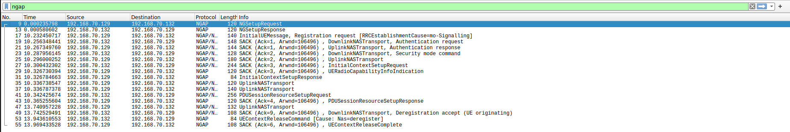
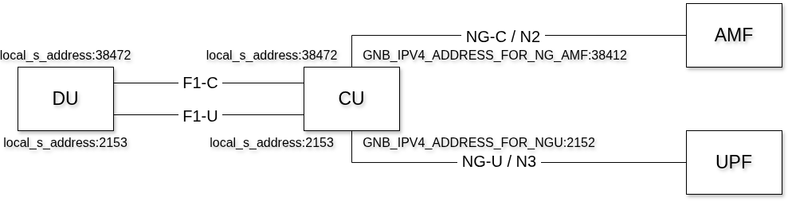
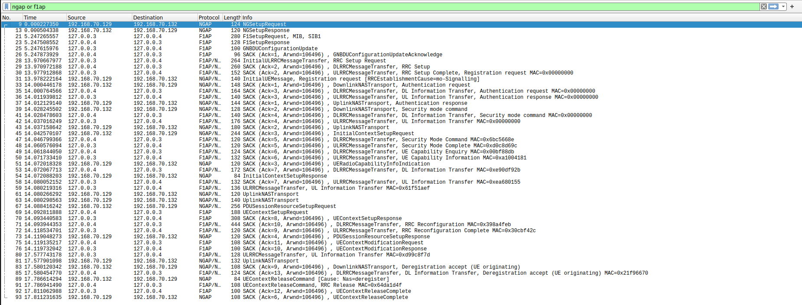
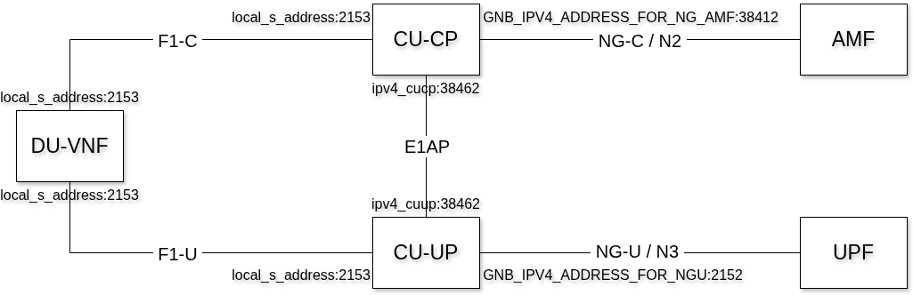
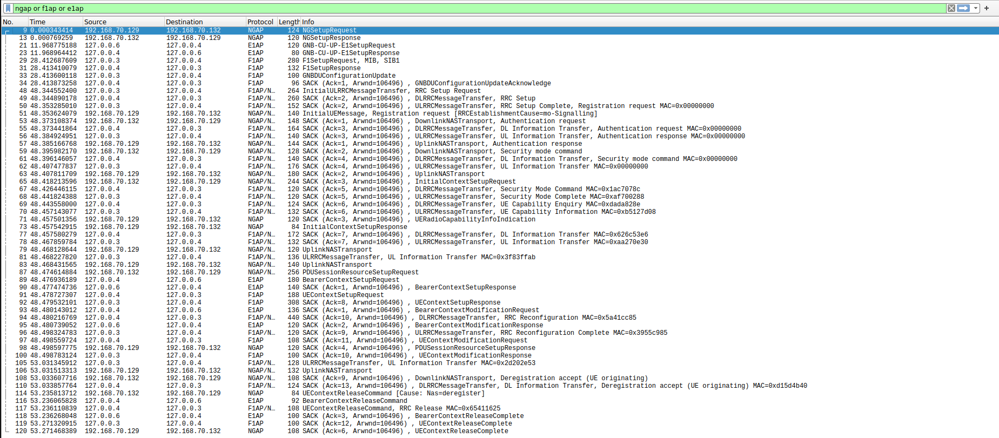
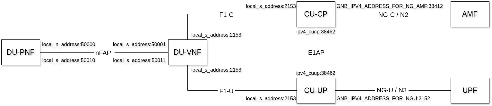
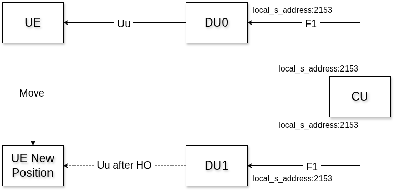
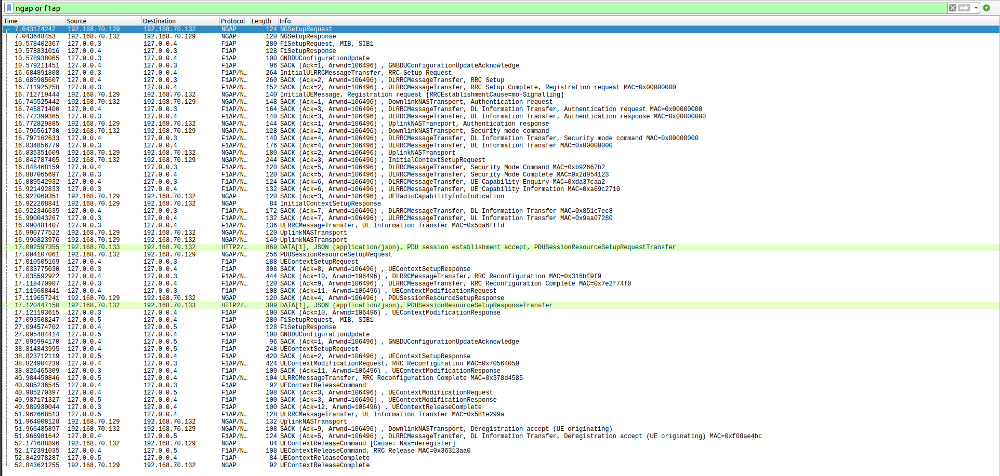
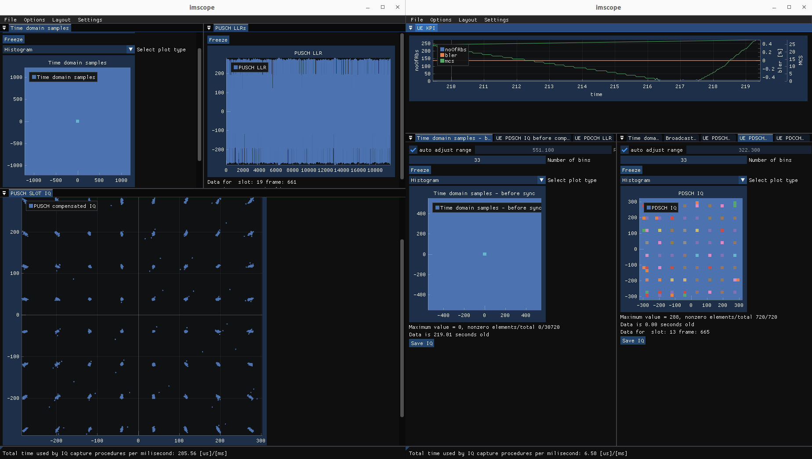
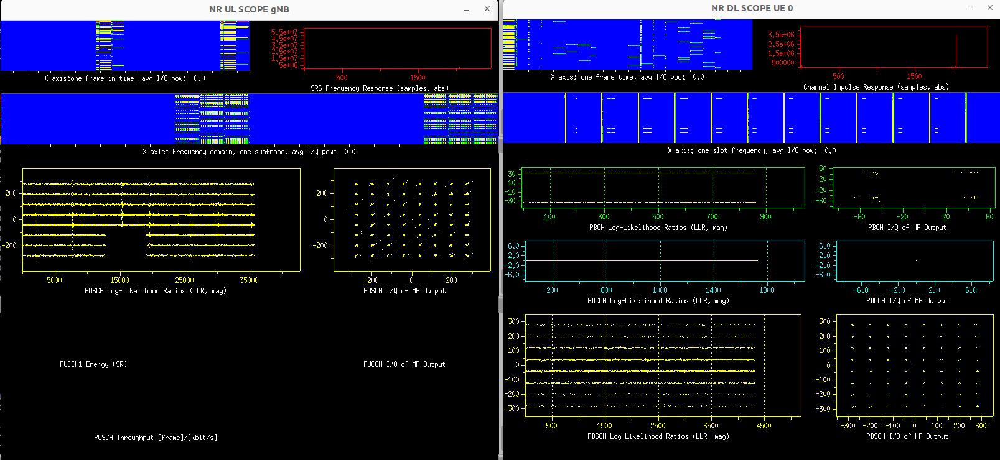

# OpenAirInterface 5G RAN @ Open6G+AI School

> Author: Robert Schmidt (March 30, 2026)

Note: this repository is hosted at [this Gitlab repository](https://gitlab.eurecom.fr/oai/trainings/oai-workshops).

**What do we cover in the RAN Hands-On?**

The aim of this tutorial is to:

1. Understand the code repository organization
2. Set up an end-to-end 5G/NR SA setup with RFsimulator from source
3. Start with the DU-CU/F1 split
4. Start with the DU-CU/F1+E1 split
5. Start with the nFAPI+F1+E1 split
6. Test F1 Handover
7. Connect multiple UEs
8. Use the scope(s) + basic channel modeling
9. NTN

> Note: this file can be converted to a presentation using

```
pandoc -t slidy --template ran.slidy -s README.md -o README.html   --metadata title="OpenAirInterface 5G RAN Workshop 2025" --metadata date="November 18, 2025"
```

---

**TABLE OF CONTENTS**

[[_TOC_]]

---

**Hardware Requirements**

1. Your laptop/remote server must have at least an 8-core CPU (or equivalent), and a minimum of 16 GB of RAM.
2. Make sure your laptop/remote server CPU supports `avx2`.
    - How to check for AVX2 support: Check `/proc/cpuinfo` for the AVX2 flag (`lscpu | grep avx2`)
3. Disk space:
    - If Ubuntu 24.04 is already installed, ensure at least 20 GB of free space.
    - If not, prepare a free partition with at least 100 GB to install Ubuntu 24.04.

**Software Prerequisites**

1. Operating system: Linux is required — no Windows or macOS (Intel/M1/M2/M3). We recommend Ubuntu 24.04. While other distributions may work, we cannot guarantee support for them.
2. Docker: version 25.04 or higher must be pre-installed.

> Note: Other necessary software will be installed.

**Reading time**: ~30mins

**Tutorial replication time**: ~90mins

---

# Preparation for RAN training session

In this session we will:

- setup an environment, install dependencies and start compilation
- have a general overview of the RAN repository

Please don't hesitate to ask questions!

---

## The RAN repository

- **Repository URL**: `https://gitlab.eurecom.fr/oai/openairinterface5g`
- **Main branch**: Work happens in the `develop` branch
- **Latest release**: `v2.4.0` (December 2025), check [Release Notes](https://gitlab.eurecom.fr/oai/openairinterface5g/-/releases/v2.4.0)
- **Weekly tags**: Usually one integration branch per week, tagged in the format `YYYY-wWW`, e.g., `2026.w13`
- **Developers**: Use `develop`
- **Main README**: See [README.md](https://gitlab.eurecom.fr/oai/openairinterface5g/-/blob/develop/README.md) in the repository root for general overview
- **Documentation**: Comprehensive documentation is available in the [`doc/`](https://gitlab.eurecom.fr/oai/openairinterface5g/-/tree/develop/doc) directory:
  - [Building OAI](https://gitlab.eurecom.fr/oai/openairinterface5g/-/blob/develop/doc/BUILD.md) - Detailed build instructions
  - [Running the modems](https://gitlab.eurecom.fr/oai/openairinterface5g/-/blob/develop/doc/RUNMODEM.md) - How to run gNB and UE
  - [System Requirements](https://gitlab.eurecom.fr/oai/openairinterface5g/-/blob/develop/doc/system_requirements.md) - Hardware and software requirements
  - [Feature Set](https://gitlab.eurecom.fr/oai/openairinterface5g/-/blob/develop/doc/FEATURE_SET.md) - Implemented 3GPP features
  - [MAC Usage](https://gitlab.eurecom.fr/oai/openairinterface5g/-/blob/develop/doc/MAC/mac-usage.md) - MAC layer configuration and statistics

---

## Repository structure

The OpenAirInterface 5G repository is organized into several main directories:

- `openair1/`: Layer 1 (3GPP LTE Rel-10/12 PHY, NR Rel-15+ PHY)
- `openair2/`: Layer 2 (3GPP LTE Rel-10 MAC/RLC/PDCP/RRC/X2AP, NR Rel-15+ MAC/RLC/PDCP/SDAP/RRC/X2AP/F1AP/E1AP), E2AP!
- `openair3/`: Layer 3 (3GPP LTE Rel-10 S1AP/GTP, NR Rel-15+ NGAP)
  - Core network interfaces (NGAP, S1AP) and GTP-U
- `common/`: Common code, generic libraries (Tpool, logging, configuration modules, \dots)
- `executables/`: LTE and NR executables
  - Main entry points for gNB, eNB, UE applications
- `radio/`: Radios and SDRs
  - Support for various SDR platforms (USRP, BladeRF, RFsimulator, FHI72, etc.)
- `nfapi/`: (n)FAPI split
- `cmake_targets/`: Everything related to compilation
  - Build scripts (`build_oai`), build artifacts in `ran_build/build`
- `doc/`: Documentation
  - Comprehensive documentation including tutorials, API docs, and design documents
- `ci-scripts/`: Everything related to CI testing
  - Test scripts, CI configurations, example config files
- `docker/`: Docker build files
  - Dockerfiles for building containerized OAI components
- `charts/`: Helm charts for Kubernetes/OpenShift deployment
- `openshift/`: OpenShift deployment configurations
- `targets/`: Configuration files (`PROJECTS`)
  - Example configuration files for different deployment scenarios

---

### Repository: Some examples

Examples:

- **Where is NR PDSCH modulation?** Called in `nr_generate_pdsch()`
- **Where is the NR PDSCH/DLSCH scheduler?** See `gNB_dlsch_ulsch_scheduler()`
- **Where is the NR RRC Reconfiguration message sent?** See `rrc_gNB_generate_dedicatedRRCReconfiguration()`
- **Where is the PDSCH simulation?** See `dlschsim.c`
- **Where is the E2 agent?** See next training session

For more details on the software architecture, see [`doc/SW_archi.md`](https://gitlab.eurecom.fr/oai/openairinterface5g/-/blob/develop/doc/SW_archi.md) in the main repository.

---

## Installation of dependencies and compilation

We assume that the main repository is located at `~/openairinterface5g` and the workshop repository at `~/oai-workshops`.

```
cd ~
git clone https://gitlab.eurecom.fr/oai/openairinterface5g.git
cd openairinterface5g/cmake_targets
./build_oai --ninja -I                       # install dependencies
```

Compile RAN executables for gNB and nrUE:

    ./build_oai --ninja --gNB --nrUE -w SIMU -c  # compile gNB and nrUE

  - "Historical" build tool
  - Some useful options: `-h`, `--eNB`, `--gNB`, `--UE`, `--nrUE`, `-c`, `--ninja`, `--sanitize-address`, `-g`, `-w`, `-P/--physical_simulators`, ...
  - By default, build artifacts are in `cmake_targets/ran_build/build` (`ran_build/` configurable, see `-d` switch)

> Note: For USRP support, you need to use the switch `-w USRP`. For O-RAN, use
> `-t oran_fhlib_5g` 

---

### Alternative compilation: cmake (recommended)

`build_oai` is a wrapper on top of `cmake`. It is possible to run `cmake` directly:

```
cd ~/openairinterface5g
mkdir build && cd build
cmake ../ -GNinja
ninja
```

You can check additional options available for compilation:

```
ccmake .
```

---

### Main executables

After build, you will find, in the build directory:

- `nr-softmodem`: main NR gNB/CU/DU executable
- `nr-uesoftmodem`: NR UE executable
- `libdfts.so`: (i)FFT library
- `libldpc.so`: LDPC library (multiple implementations)
- `librfsimulator.so`/`liboai_usrpdevif.so`/...: radio libraries
- `nr_*sim`: 5G unitary/physical simulators
- `nr-cuup`: CU-UP
- `lte-softmodem`/`lte-uesoftmodem`/other `*sim`: LTE executables

---

# Hands-On

- Set up a working system using simulated SDR
- Develop basic and advanced understanding of various aspects of OAI to facilitate special trainings later (vrtsim, E2 agent, USRPs, security).

## About the RFsimulator

- Virtual SDR device: replaces physical radio hardware (e.g., USRP boards)
- Easy setup: test OAI without an RF board by forwarding time-domain I/Q
  samples
- Simple: eliminates unpredictable over-the-air perturbations
- Debugging: perfect for development/testing
- Non-realtime: ideal for checking signal processing algorithms and protocol
  implementations
- Channel modeling support: simulate simple channels such as AWGN and other
  channel models

## Other radios

- virtual real-time radio: `vrtsim`, can be used for softwarized performance
  evaluation/test throughput
- hardware-based: USRPs, O-RUs/O-RAN 7.2 FHI

---

### Use Cases

- Development and debugging: Test signal processing and protocol implementations without hardware
- Workshops and training: Easy setup for multiple participants without interference
- Channel modeling: Test algorithms under controlled channel conditions
- Multi-UE testing: Support for connecting multiple UEs to a single gNB
- NTN simulation: Can simulate satellite propagation delays (e.g., GEO: 238.74 ms one-way)

### Limitations

- Power control: `txgain`/`rxgain` settings are not supported
- CPU-bound: Performance depends on available CPU resources

### Documentation

For detailed information about the RFsimulator, see:

- [RFsimulator README](https://gitlab.eurecom.fr/oai/openairinterface5g/-/blob/develop/radio/rfsimulator/README.md) - Complete RFsimulator documentation
- [Channel Simulation](https://gitlab.eurecom.fr/oai/openairinterface5g/-/blob/develop/openair1/SIMULATION/TOOLS/DOC/channel_simulation.md) - Channel modeling details
- [Running the modems](https://gitlab.eurecom.fr/oai/openairinterface5g/-/blob/develop/doc/RUNMODEM.md) - General usage information

---

## How to create a docker image

- Creating a Docker image is a 3-step process (due to CI specificities):
  - `ran-base` for dependencies (shared image)
  - `ran-build` for compiling all targets (shared image)
  - Per-target (eNB, gNB, nrUE, lteUE, \dots) images
- First, build the shared images:
  ```
  docker build --target ran-base --tag ran-base:latest --file docker/Dockerfile.base.ubuntu .
  docker build --target ran-build --tag ran-build:latest --file docker/Dockerfile.build.ubuntu .
  ```
- Then, build the target images, e.g., gNB and nrUE (as used in the CN session):
  ```
  docker build --target oai-gnb --tag oai-gnb:latest --file docker/Dockerfile.gNB.ubuntu .
  ```
- See also [`docker/README.md`](https://gitlab.eurecom.fr/oai/openairinterface5g/-/blob/develop/docker/README.md) in the main repository for detailed Docker build instructions

---

## Basic end-to-end setup

### Startup

Start the core network:
```
cd ~/oai-workshops/cn/
docker compose -f docker-compose.yml up -d
watch -n 1 docker compose -f docker-compose.yml ps -a
```

Once all containers are healthy, run Wireshark and capture NGAP traffic:

```
sudo wireshark -k -i any -Y "ngap"
```

Then, start the gNB:

```
cd ~/openairinterface5g/cmake_targets/ran_build/build
./nr-softmodem -O ~/oai-workshops/ran/conf/gnb.sa.band78.106prb.rfsim.conf --rfsim --log_config.global_log_options utc_time
```

Check that you see the NGAP Setup Request and Response messages in Wireshark.

Run the nrUE from a second terminal:

```
cd ~/openairinterface5g/cmake_targets/ran_build/build
sudo ./nr-uesoftmodem -C 3619200000 -r 106 --numerology 1 --ssb 516 -O ~/oai-workshops/ran/conf/ue.conf --rfsim --log_config.global_log_options utc_time
```

---

Verify that it is connected: you should see the following output at gNB:

```
[19:23:26.397078] [NR_RRC] [UL] (cellID bc614e, UE ID 1 RNTI c2d2) Received RRCReconfigurationComplete
[19:23:26.397127] [NR_RRC] PDU Session Setup: ID=10, outgoing TEID=0x8bbb99de, Addr=192.168.70.129
[19:23:26.397133] [NR_RRC] NGAP_PDUSESSION_SETUP_RESP: sending the message
[19:23:26.397436] [NR_MAC] DU received confirmation of successful RRC Reconfiguration
```

and nrUE:

```
[19:23:26.377172] [NR_RRC] rrcReconfigurationComplete Encoded 10 bits (2 bytes)
[19:23:26.377178] [NR_RRC]  Logical Channel UL-DCCH (SRB1), Generating RRCReconfigurationComplete (bytes 2)
[19:23:26.377185] [NAS]    Received PDU Session Establishment Accept, UE IPv4: 10.0.0.2
Unknown IEI 129
[19:23:26.377806] [OIP]    Interface oaitun_ue1 successfully configured, IPv4 10.0.0.2, IPv6 (null)
```

Correspondingly, an interface should have been brought up:
```
24: oaitun_ue1: <POINTOPOINT,NOARP,UP,LOWER_UP> mtu 1500 qdisc fq_codel state UNKNOWN group default qlen 500
    link/none
    inet 10.0.0.3/24 scope global oaitun_ue1
       valid_lft forever preferred_lft forever
    inet6 fe80::d166:f94e:7413:3f79/64 scope link stable-privacy
       valid_lft forever preferred_lft forever
```

Some other things to check:

- You see the RA procedure of the UE in the gNB logs

---



---

### Inject traffic
- Check the UE's IP address on interface `oaitun_ue1` using:
  ```
  ip address show oaitun_ue1
  ```
- The IP address `192.168.70.135` is the address of the `oai-ext-dn` container.
- Ping test:
  - From the UE ("UL") — ping from the UE (host) to the `oai-ext-dn` container:
    ```
    ping -I oaitun_ue1 192.168.70.135
    ```
  - From the `oai-ext-dn` ("DL") — ping from the `oai-ext-dn` container to the UE:
    ```
    docker exec -it oai-ext-dn ping <UE IP address>  # from container, "DL"
    ```

- Iperf3 test:
Iperf3 can be used to test UL and DL throughput between the `oai-ext-dn` (in Docker) and the UE (running locally):
  - start the iperf3 server inside the container:
    ```
    docker exec -it oai-ext-dn bash -c "iperf3 -s"
    ```
  - On the host, in a new terminal, run the iperf3 client and bind the UE IP address:
    ```
    iperf3 -B <UE IP ADDRESS> -c 192.168.70.135 -u -b 50M -R # DL
    iperf3 -B <UE IP ADDRESS> -c 192.168.70.135 -u -b 20M    # UL
    ```
  - if your iperf3 version is > 3.10, you can use `--bind-dev` option instead of `-B`
    ```
    iperf3 --bind-dev oaitun_ue1 -c 192.168.70.135 -u -b 50M -R # DL
    iperf3 --bind-dev oaitun_ue1 -c 192.168.70.135 -u -b 20M    # UL
    ```

---

## CU-DU F1 split

- Start Wireshark with capture filter `sctp` and display filter `ngap or f1ap`
```
sudo wireshark -k -i any -f "sctp" -Y "ngap or f1ap"
```
- Start the gNB as follows:
  ```
  ./nr-softmodem -O ~/oai-workshops/ran/conf/gnb-cu.sa.f1.conf --log_config.global_log_options utc_time
  ./nr-softmodem -O ~/oai-workshops/ran/conf/gnb-du.sa.band78.106prb.rfsim.conf --rfsim --log_config.global_log_options utc_time
  ```
- Start the UE as before:
  ```
  sudo ./nr-uesoftmodem -C 3319680000 -r 106 --numerology 1 --ssb 516 -O ~/oai-workshops/ran/conf/ue.conf --rfsim --log_config.global_log_options utc_time
  ```

- Compare the IP addresses in the config with what you have below to understand
  the interfaces



---



---

## CU-DU F1 + E1 split

- Start Wireshark with capture filter `sctp` and display filter `ngap or f1ap or e1ap`
```
sudo wireshark -k -i any -f "sctp" -Y "ngap or f1ap or e1ap"
```
- Start the gNB as follows
  ```
  ./nr-softmodem -O ~/oai-workshops/ran/conf/gnb-cucp.sa.f1.rfsim.conf --rfsim --log_config.global_log_options utc_time
  ./nr-cuup -O ~/oai-workshops/ran/conf/gnb-cuup.sa.f1.rfsim.conf --log_config.global_log_options utc_time
  ./nr-softmodem -O ~/oai-workshops/ran/conf/gnb-du.sa.band78.106prb.rfsim.conf --log_config.global_log_options utc_time
  ```
- Start the UE as before:
  ```
  sudo ./nr-uesoftmodem -C 3319680000 -r 106 --numerology 1 --band 78 --ssb 516 -O ~/oai-workshops/ran/conf/ue.conf --rfsim --log_config.global_log_options utc_time
  ```
- Compare the IP addresses in the config with what you have below to understand
  the interfaces



---



---

## nFAPI + F1 + E1 split

- Start Wireshark with capture filter `sctp` and display filter `ngap or f1ap or e1ap`
- Start the gNB as follows:
  - Start CU-CP
  ```
  ./nr-softmodem -O ~/oai-workshops/ran/conf/gnb-cucp.sa.f1.rfsim.conf --log_config.global_log_options utc_time
  ```
  - Start CU-UP
  ```
  ./nr-cuup -O ~/oai-workshops/ran/conf/gnb-cuup.sa.f1.rfsim.conf --log_config.global_log_options utc_time
  ```
  - Start DU-High
  ```
  ./nr-softmodem -O ~/oai-workshops/ran/conf/gnb-vnf.sa.band66.u0.25prb.nfapi.conf --nfapi VNF --log_config.global_log_options utc_time
  ```
  - Start DU-Low
  ```
  ./nr-softmodem -O ~/oai-workshops/ran/conf/gnb-pnf.band66.rfsim.conf --nfapi PNF --rfsim --log_config.global_log_options utc_time
  ```
- Start UE
  ```
  sudo ./nr-uesoftmodem -C 2152680000 --CO -400000000 -r 25 --numerology 0 --band 66 --ssb 48 -O ~/oai-workshops/ran/conf/ue.conf --rfsim --log_config.global_log_options utc_time
  ```



---

### A closer look at the gNB periodic output
The scheduler periodically outputs statistics that can help assess the radio channel quality and explain why a UE may not perform as expected.

Example:
```
[NR_MAC]  Frame.Slot 128.0
UE RNTI cb4d CU-UE-ID 1 in-sync PH 48 dB PCMAX 20 dBm, average RSRP -44 (16 meas)
UE cb4d: dlsch_rounds 92/0/0/0, dlsch_errors 0, pucch0_DTX 0, BLER 0.00003 MCS (0) 0 CCE fail 3
UE cb4d: ulsch_rounds 750/0/0/0, ulsch_errors 0, ulsch_DTX 0, BLER 0.00000 MCS (0) 0 (Qm 2 deltaMCS 0 dB) NPRB 5  SNR 51.0 dB CCE fail 0
UE cb4d: MAC:    TX           2308 RX          19918 bytes
UE cb4d: LCID 1: TX            528 RX            281 bytes
UE cb4d: LCID 2: TX              0 RX              0 bytes
UE cb4d: LCID 4: TX             30 RX           1557 bytes
```

In the first line,

- `UE RNTI`: this is also used as the DU UE ID over F1; each line
  is prepended with the RNTI
- `CU UE ID`: separate identifier from the RNTI to handle multiple
  UEs across DUs (in which case RNTI conflicts are possible)
- `PH`: Power Headroom, the amount of power the UE has left. If it is > 40 you
  can achieve full UL throughput. `PCMAX` (`24 dBm`) is what the UE reported as
  maximum UL transmit power it can output in the channel.
- `RSRP`: measured power of the DL reference signals at the UE. >-80dBm
  you should have full DL throughput. <-95 dBm, you are very limited in terms
  of connectivity.
- `SINR`: measured signal to interference and noise ratio of the SSB
  received at the UE. Maximum value that can be reported by the UE is 40.0 dB.

The fourth and fifth lines show HARQ-related information.

In the last lines,

- `MAC` shows the amount of MAC PDU bytes scheduled in transmit (`TX`,
  `1530943191`) and receive (`RX`, `194148`) directions
- `LCID X` shows the amount of MAC SDU/RLC PDU data for Logical Channel ID with
  ID `X` in transmit and receive directions. LCIDs 1 and 2 are mapped to SRBs 1
  and 2. LCIDs 4 and onward are mapped to DRBs 1 onward. If you have an LCID 4,
  it means you have a PDU session.

For other parameters, see [`doc/MAC/mac-usage.md`](https://gitlab.eurecom.fr/oai/openairinterface5g/-/blob/develop/doc/MAC/mac-usage.md) in the main repository.

---

### A closer look at the config file

#### `gNBs` section
- `plmn_list`: list of PLMNs, with MCC, MNC, and NSSAIs; needs to match the CN config
- `tracking_area_code`: Tracking Area Code; needs to match the CN config
- `amf_ip_address.[0].ipv4`: IP address of AMF
- `NETWORK_INTERFACES.GNB_IPV4_ADDRESS_FOR_NG_AMF` and `NETWORK_INTERFACES.GNB_IPV4_ADDRESS_FOR_NGU`: IP address on which the gNB is running
- `min_rxtxtime`: minimum feedback time (e.g., PDSCH to PUCCH), is 5 for OAI UE
  and 2 for commercial UE
- `absoluteFrequencySSB` and `dl_absoluteFrequencyPointA`: frequencies for synchronization signal block and "PointA", in ARFCN; [use a calculator instead of getting mad](http://sqimway.com/nr_refA.php)
- TDD configuration is in `nrofDownlinkSlots`, `nrofUplinkSlots`,
  `nrofDownlinkSymbols` and `nrofUplinkSymbols`

> Notes:
> - If an option is not given, a default is used (which might or might not prevent the gNB from starting)
> - You can override many options on the command line. Example: `./nr-softmodem -O gnb.conf --MACRLCs.[0].dl_max_mcs 20`


---

#### `MACRLCs` section

- `ulsch_max_frame_inactivity`: maximum number of frames until UE is scheduled
  automatically even without requesting it. Often set to `0` or `1` for lower
  latency, but this is "artificial"
- `pusch_TargetSNRx10`, `pucch_TargetSNRx10`: target SNRs multiplied by ten for
  these channels; increasing can sometimes stabilize a system
- `dl_harq_round_max`, `ul_harq_round_max`: maximum number of MAC HARQ rounds
- `dl_max_mcs`, `ul_max_mcs`: maximum MCS to be scheduled

Other parameters: see [`openair2/GNB_APP/MACRLC_nr_paramdef.h`](https://gitlab.eurecom.fr/oai/openairinterface5g/-/blob/develop/openair2/GNB_APP/MACRLC_nr_paramdef.h) in the main repository

---

#### `RUs` section

- `nb_tx`, `nb_rx`: number of transmit/receive antennas to use
- `max_rxgain`: maximum receive gain to be used (IIRC only used for USRP)
- `att_tx`, `att_rx`: attenuation for transmit/receive signals to be applied at
  the gNB. In many lab scenarios, the receiver of a UE is saturated if the gNB
  sends with full power; hence you need a value greater than `0` (try, in
  order: `6`, `12`, `18`)
- `sdr_addrs`: arguments to be passed to search for SDR, e.g., IP address for
  N310

---

#### `fhi_72` section

- `dpdk_devices`: PCI addresses of virtual function (VF) NICs
- `system_core`/`io_core`/`worker_cores`: cores for DPDK/xran workloads
- `ru_addr`: array of RU addresses, on per VF
- `fh_config`: array of RU configuration
  * `ru_config`:
    - `iq_width`: IQ bitwidth. 16=uncompressed, <16=compressed mode.
    - `iq_width_prach`: same for PRACH
- `dpdk_mem_size`: size of pre-allocated huge pages

---

## F1 Handover (intra-gNB)

- Start Wireshark with capture filter `sctp` and display filter `ngap or f1ap`
```
sudo wireshark -k -i any -Y "ngap or f1ap"
```
Exercise: Compare configuration files for DUs: `gnb-du.sa.band78.106prb.rfsim.pci0.conf` and `gnb-du.sa.band78.106prb.rfsim.pci1.conf`? Check DU ID, Cell ID, Physical Cell ID

- Start CU:
```
./nr-softmodem -O ~/oai-workshops/ran/conf/gnb-cu.sa.f1.conf --telnetsrv --telnetsrv.shrmod ci
```
- Start DU0:
```
sudo ./nr-softmodem --rfsim -O ~/oai-workshops/ran/conf/gnb-du.sa.band78.106prb.rfsim.pci0.conf --rfsimulator.[0].serveraddr ::1
```
> Note: You might see following error after the DU1 start,
> ```
> [HW    ]  Trying to connect to ::1:4043
> [HW    ]  connect() to ::1:4043 failed, errno(111)
> ```
> This message will disappear once connected to RF simulator server - see next step.

- Start the UE (acts as a server)
```
sudo ./nr-uesoftmodem -C 3619200000 -r 106 --numerology 1 --ssb 516 --rfsim -O ~/oai-workshops/ran/conf/ue.conf --log_config.global_log_options function --rfsimulator.[0].serveraddr server
```
- Start DU1:
```
sudo ./nr-softmodem --rfsim -O ~/oai-workshops/ran/conf/gnb-du.sa.band78.106prb.rfsim.pci1.conf --rfsimulator.[0].serveraddr ::1
```
- Trigger F1 handover
```
echo ci trigger_f1_ho | nc 127.0.0.1 9090 && echo
```



---



---

## Multiple UEs

- All UEs try to open the same interface, which does not work
- Create network namespace for each UE to prevent interface name clash
- Follow instructions from [this link](https://open-cells.com/index.php/2021/02/08/rf-simulator-1-enb-2-ues-all-in-one/) or use the script [multi-ue.sh](./multi-ue.sh)
- Start first UE as
  ```
  sudo ~/oai-workshops/ran/multi-ue.sh -c1 -e
  ./nr-uesoftmodem -r 106 --numerology 1 --band 78 -C 3619200000 -O /home/oai/oai-workshops/ran/conf/ue.conf --rfsim --rfsimulator.[0].serveraddr 10.201.1.100 --log_config.global_log_options utc_time
  ```
- Check in Wireshark/UE output that everything is ok
- Second UE *with a different IMSI*:
  ```
  sudo ~/oai-workshops/ran/multi-ue.sh -c2 -e
  ./nr-uesoftmodem -r 106 --numerology 1 --band 78 -C 3619200000 -O /home/oai/oai-workshops/ran/conf/ue.conf --rfsim --uicc0.imsi 001010000000102 --rfsimulator.[0].serveraddr 10.202.1.100 --log_config.global_log_options utc_time
  ```

### Exercise
- Check in Wireshark that both are set up
- Create traffic from/to both UEs
- Hints:
  ```
  sudo ip netns exec ue1 bash
  sudo ip netns exec ue2 bash
  ```
### Cleanup
- At the end, remove network namespaces:
  ```
  sudo ~/oai-workshops/ran/multi-ue.sh -d1 -d2
  ```

---

## Scopes

The scopes allow you to see various channels.

### ImScope

- Install dependencies:
  ```
  sudo apt-get install libglfw3-dev libopengl-dev
  ```
- Build scope
  ```
  cd ~/openairinterface5g/cmake_targets/
  ./build_oai --build-lib imscope --ninja
  cd ran_build/build/
  cmake -DENABLE_IMSCOPE=ON ../../.. && ninja imscope # alternative
  ```
- Run the `nr-softmodem` and `nr-uesoftmodem` with `--imscope` switch

Example commands:

- Run gNB:
  ```
  ./nr-softmodem -O ~/oai-workshops/ran/conf/gnb.sa.band78.106prb.rfsim.conf --rfsim --imscope --log_config.global_log_options utc_time
  ```

- Run UE:
  ```
  sudo ./nr-uesoftmodem -C 3619200000 -r 106 --numerology 1 --ssb 516 -O ~/oai-workshops/ran/conf/ue.conf --rfsim --imscope --log_config.global_log_options utc_time
  ```

- For more information about scopes and troubleshooting, refer to: [ImScope documentation](https://gitlab.eurecom.fr/oai/openairinterface5g/-/blob/develop/openair1/PHY/TOOLS/readme.md)

---



---

### Xforms

- Install dependencies:
  ```
  sudo apt-get install libforms-bin libforms-dev
  ```
- Build scope:
  ```
  cd ~/openairinterface5g/cmake_targets/
  ./build_oai --build-lib nrscope --ninja
  cd ran_build/build/
  cmake -DENABLE_NRSCOPE=ON ../../.. && ninja nrscope # alternative
  ```
- Run `nr-softmodem` and `nr-uesoftmodem` with `-d` switch
- The error:
  ```
  In fl_initialize() [flresource.c:995]: 5G-gNB-scope: Cant open display :0
  In fl_bgn_form() [forms.c:347]: Missing or failed call of fl_initialize()
  ```
  can be solved by granting root the right to open the X display:
  ```
  xhost +si:localuser:root
  ```
Example commands:

- Run gNB:
  ```
  ./nr-softmodem -O ~/oai-workshops/ran/conf/gnb.sa.band78.106prb.rfsim.conf --rfsim -d --log_config.global_log_options utc_time
  ```

- Run UE:
  ```
  sudo ./nr-uesoftmodem -C 3619200000 -r 106 --numerology 1 --ssb 516 -O ~/oai-workshops/ran/conf/ue.conf --rfsim -d --log_config.global_log_options utc_time
  ```

---



---

## Channel Models

### Enabling channels

- We will simply add Gaussian noise
- Uncomment the last line in both the gNB and UE config files:
  ```
  @include "channelmod_rfsimu.conf"
  ```
- Add the options `--rfsimulator.[0].options chanmod --rfsimulator.[0].modelname AWGN` to the gNB and UE command lines and start them
- More info: See [`openair1/SIMULATION/TOOLS/DOC/channel_simulation.md`](https://gitlab.eurecom.fr/oai/openairinterface5g/-/blob/develop/openair1/SIMULATION/TOOLS/DOC/channel_simulation.md) in the main repository, channel models defined in [`openair1/SIMULATION/TOOLS/random_channel.c`](https://gitlab.eurecom.fr/oai/openairinterface5g/-/blob/develop/openair1/SIMULATION/TOOLS/random_channel.c)

- Run gNB:
  ```
  ./nr-softmodem -O ~/oai-workshops/ran/conf/gnb.sa.band78.106prb.rfsim.conf --rfsim --imscope --rfsimulator.[0].options chanmod --rfsimulator.[0].modelname AWGN --log_config.global_log_options utc_time
  ```
- Run UE:
  ```
  sudo ./nr-uesoftmodem -C 3619200000 -r 106 --numerology 1 --ssb 516 -O ~/oai-workshops/ran/conf/ue.conf --rfsim --rfsimulator.[0].options chanmod --rfsimulator.[0].modelname AWGN --log_config.global_log_options utc_time
  ```

---

### Dynamically modifying Channel Model Parameters using Telnet

- Make sure the telnet shared library is compiled:
  ```
  cd ~/openairinterface5g/cmake_targets/
  ./build_oai --build-lib telnetsrv --ninja
  cd ran_build/build/
  cmake ../../.. -DENABLE_TELNETSRV=ON && ninja telnetsrv
  ```
- Start the `nr-softmodem`/`nr-uesoftmodem` with parameter `--telnetsrv`

> Note: Configure the UE telnet port to be different from the gNB: `--telnetsrv.listenport 9091`

- In a new terminal: connect to gNB/UE: `telnet 127.0.0.1 9090`
  - Use `help` to show available commands
  - Use `channelmod show current` to show current channel model configuration
  - Use `channelmod help` to show available parameters to change
  - Example: change noise using `channelmod modify 1 noise_power_dB -5`
- More information: See [`openair1/SIMULATION/TOOLS/DOC/channel_simulation.md`](https://gitlab.eurecom.fr/oai/openairinterface5g/-/blob/develop/openair1/SIMULATION/TOOLS/DOC/channel_simulation.md) in the main repository

Example commands:

- gNB
  ```
  ./nr-softmodem -O ~/oai-workshops/ran/conf/gnb.sa.band78.106prb.rfsim.conf --rfsim --imscope --rfsimulator.[0].options chanmod --rfsimulator.[0].modelname AWGN --telnetsrv --log_config.global_log_options utc_time
  ```
- UE
  ```
  sudo ./nr-uesoftmodem -C 3619200000 -r 106 --numerology 1 --ssb 516 -O ~/oai-workshops/ran/conf/ue.conf --rfsim --imscope --rfsimulator.[0].options chanmod --rfsimulator.[0].modelname AWGN --telnetsrv --telnetsrv.listenport 9091 --log_config.global_log_options utc_time
  ```
- Connect to the local telnet interface to view or modify channel parameters:
  ```
  telnet 127.0.0.1 9090
  ```
Once connected, you can display the current channel configuration and adjust parameters as needed:
  ```
  channelmod show current
  channelmod modify 1 noise_power_dB -5
  ```
Observe the change of noise_power_dB in the scope to verify the effect of the modification.

---

## NTN setup (Exercise)

Exercise: simulate non-terrestrial communication for a geostationary satellite
(only signal delay, no other impairments) using the knowledge you acquired in
this workshop.

- Run the gNB:
  ```
  ./nr-softmodem --rfsim -O ../../../ci-scripts/conf_files/gnb.sa.band254.u0.25prb.rfsim.ntn.conf
  ```
  Note: you have to potentially adapt PLMN, and AMF and gNB IP addresses, to
  make this connect reliably. The rest is set in the config (no additional
  command line parameters required.
- Run the UE:
  ```
  sudo ./nr-uesoftmodem --rfsim --band 254 -C 2488400000 --CO -873500000 -r 25 --numerology 0 --ssb 60 --rfsimulator.[0].prop_delay 238.74 --num-ul-actors 1 --num-dl-actors 1 -O ../../../ci-scripts/conf_files/nrue.uicc.conf
  ```
  Also here, you might need to change the IMSI and other authentication-related
  parameters.
- If you run this, notice that it runs much faster than what you would expect.
  Explain this.
- You might be interested to run this with normal (real-time) speed. Apply and
  compile the below patch, which will slow down RFsim. What do you observe now?

```
  diff --git a/radio/rfsimulator/simulator.c b/radio/rfsimulator/simulator.c
index 94234a755f..6cd7a69c93 100644
--- a/radio/rfsimulator/simulator.c
+++ b/radio/rfsimulator/simulator.c
@@ -1067,6 +1067,22 @@ static int rfsimulator_read(openair0_device *device, openair0_timestamp *ptimest
     LOG_D(HW, "Rfsimulator: velocity %.2f Msps, realtime requirements %.2f Msps\n", average / 1e6, t->sample_rate / 1e6);
   }

+  static struct timespec now;
+  if (now.tv_nsec == 0) {
+    // first time here: initialize to current time
+    int r = clock_gettime(CLOCK_MONOTONIC, &now);
+    DevAssert(r == 0);
+  } else {
+    // advance by half a millisecond
+    now.tv_nsec += 1000000;
+    if (now.tv_nsec > 999999999) {
+      now.tv_nsec -= 1000000000;
+      now.tv_sec++;
+    }
+  }
+  int r = clock_nanosleep(CLOCK_MONOTONIC, TIMER_ABSTIME, &now, NULL);
+  DevAssert(r == 0);
+
   *ptimestamp = t->nextRxTstamp; // return the time of the first sample
   t->nextRxTstamp += nsamps;
   LOG_D(HW,
```

---
